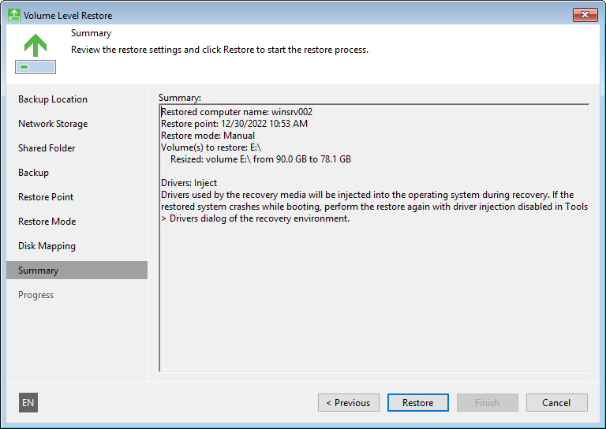

# Step 12. Start Restore Process

At the Summary step of the wizard, finalize the recovery process.

1. Review the specified recovery settings.
2. Click Restore to start the recovery process. Veeam Agent for Microsoft Windows will perform partition re-allocation operations if necessary, restore the necessary data from the backup and overwrite data on your computer with it.

