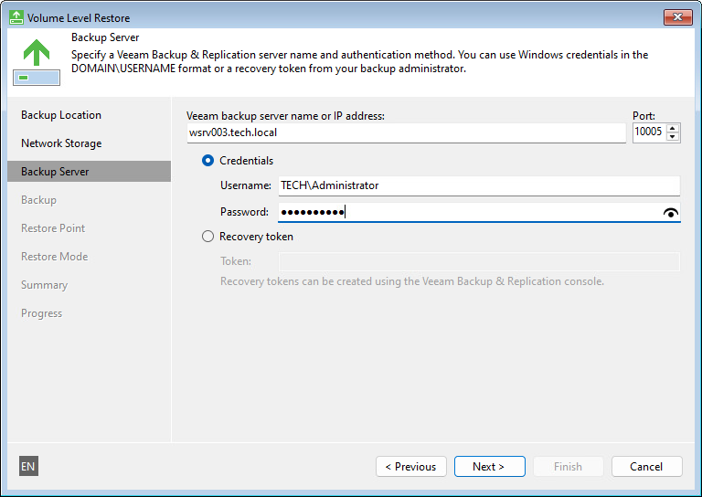
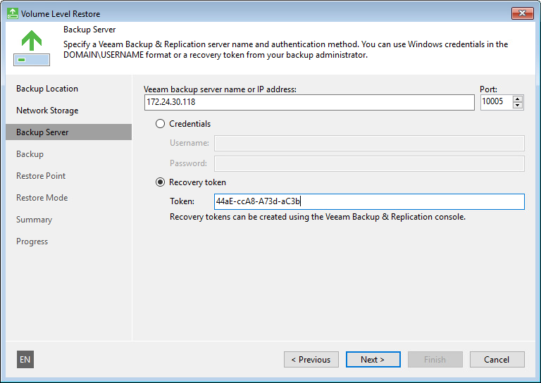

# Backup Server Settings

The Backup Server step of the wizard is available if you have chosen to restore data from a backup file located in a backup repository.

Specify settings for the Veeam backup server that manages the backup repository:

1. In the Veeam backup server name or IP address field, specify a DNS name or IP address of the Veeam backup server.
2. In the Port field, specify a number of the port over which Veeam Agent for Microsoft Windows must communicate with the backup server. By default, Veeam Agent for Microsoft Windows uses port 10005.
3. Select one of the following authentication methods to access the Veeam backup repository:

* Credentials — in the Username and Password fields, enter a user name and password of the account that has access to this backup repository.

Permissions on the backup repository managed by the target Veeam backup server must be granted beforehand. To learn more, see [Setting Up User Permissions on Backup Repositories](integrate_permissions.md).

|  |
| --- |
| NOTE |
| If you want to perform bare metal restore from a backup created by Veeam Agent operating in the managed mode and stored in the Veeam backup repository, you must use an account that has the Veeam Backup Administrator or Veeam Restore Operator role on the Veeam backup server. For more information about user roles, see the [Users and Roles](https://helpcenter.veeam.com/docs/vbr/userguide/users_roles.html?ver=13) section in the Veeam Backup & Replication User Guide. |

* Recovery token — in the Token field, enter the recovery token created on the Veeam Backup & Replication side. In this case, you will be able to recover data only from the backup for which the recovery token was generated.

The recovery token must be created beforehand. To learn more, see the [Creating Recovery Token](https://helpcenter.veeam.com/docs/vbr/userguide/agent_backup_recovery_token.html?ver=13) section in the Veeam Backup & Replication User Guide.

After you click Next, you will be prompted to check the Veeam backup server certificate. Click View Certificate to check the certificate. Click Continue to connect to the Veeam backup server.

After you click Next, you will be prompted to check the Veeam backup server certificate. Click View Certificate to check the certificate. Click Continue to connect to the Veeam backup server.

