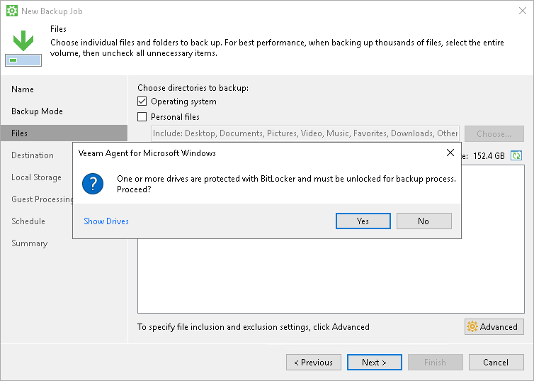
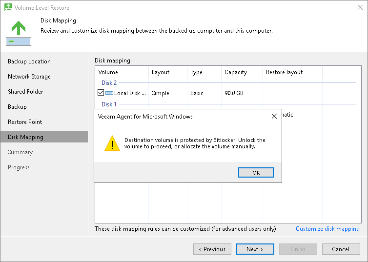
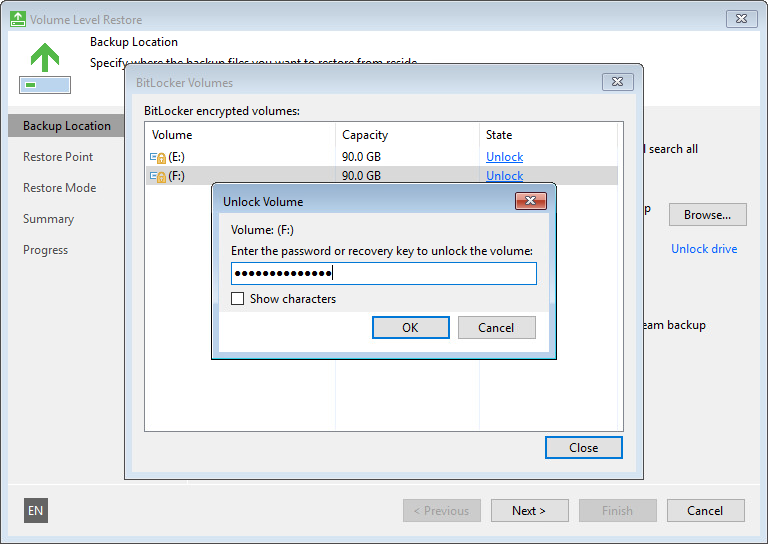

# BitLocker Encrypted Volumes Support

Veeam Agent for Microsoft Windows supports scenarios of data backup and restore to/from volumes encrypted with Microsoft Windows BitLocker.

Data Backup

You can create backups of BitLocker encrypted volumes and store backups created with Veeam Agent for Microsoft Windows on BitLocker encrypted volumes.

BitLocker encrypted volumes (both source and target) must be unlocked at the moment when Veeam Agent for Microsoft Windows starts the backup operation.

* If the volume added to the backup scope is locked at the moment of backup, the backup job will be unable to process it and will fail.
* If the volume on which the backup file must be stored is locked at the moment of backup, the backup job will be unable to save the resulting file, and the job will fail.

Data Restore

You can restore data from backups stored on BitLocker encrypted volumes and restore data to BitLocker encrypted volumes.

Veeam Agent for Microsoft Windows restores volumes in their initial state:

* If you restore an encrypted volume to its original location, the restored volume will be encrypted.
* If you restore an unencrypted volume to an encrypted volume, the restored volume will be unencrypted.

|  |
| --- |
| IMPORTANT |
| If you resize a BitLocker encrypted volume during restore, the restored volume will be unencrypted. To learn more about volume resize, see [Volume Resize](data_restore_with_volume_resize.md). |

BitLocker encrypted volumes must be unlocked at the moment when you perform the restore operation.

* If the backup file is stored on a locked volume, Veeam Agent for Microsoft Windows will fail to access it, and you will not be able to restore data from it.

* If you perform volume-level restore, and the target volume is locked, Veeam Agent for Microsoft Windows will display a warning and will ask you to unlock the volume. You can do this using the Microsoft Windows UI.

Veeam Recovery Media

If you boot from the Veeam Recovery Media, you can restore data from backups stored on BitLocker encrypted volumes and restore data to BitLocker encrypted volumes.

* If the backup file that you want to use for data restore resides on a locked volume, Veeam Agent for Microsoft Windows cannot access this backup file. To unlock the volume with the backup file, click Unlock drive under the Backup file field and enter a password for the volume.

* If you restore a volume to its original location when it is BitLocker encrypted and locked, Veeam Agent tries to unlock the target volume automatically and keep BitLocker encryption enabled for the volume. If Veeam Agent cannot unlock the volume, it displays a warning message at the Restore Mode step of the wizard. In this case, you can use one of the following scenarios:

* You can restore data to the target volume and keep BitLocker encryption enabled for the volume. To do this, you must unlock the volume before you start data restore.

To unlock the volume, click Cancel in the warning window. At the Restore Mode step of the wizard, select Manual Restore. At the Disk Mapping step of the wizard, click Customize disk mapping and click Unlock under the necessary volume.

* You can restore data to the target volume and disable BitLocker encryption for the volume. To do this, click OK in the warning window. Veeam Agent will delete existing BitLocker encrypted partitions on the volume, format the disk and restore data from the backup as unencrypted.

* If you restore a volume to a new location that is BitLocker encrypted and locked, Veeam Agent will delete existing BitLocker encrypted partitions on the volume, format the disk and restore data from the backup as unencrypted.

|  |
| --- |
|  IMPORTANT |
| Veeam Agent for Microsoft Windows cannot back up volumes formatted as FAT32 and encrypted with BitLocker. In general, FAT32 does not allow storing VSS snapshots on the same volume. When Veeam Agent for Microsoft Windows triggers a VSS snapshot of a FAT32 formatted volume, the VSS snapshot is stored on another, non-FAT32 volume on the computer.  If BitLocker is enabled, the VSS cannot save the snapshot on another volume due to Microsoft limitations, and the backup process fails. |

