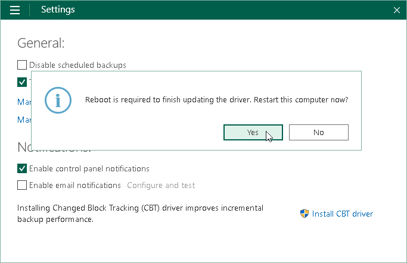

# Installing Veeam CBT Driver

You can install the Veeam CBT driver at any time you need. To use the Veeam CBT driver, the Veeam Agent computer must meet the following requirements:

* Run one of the following OSes:

* Microsoft Windows 11 (from version 22H2 to version 25H2).

* Microsoft Windows 10 General Availability Channel 22H2.

* Microsoft Windows 10 Long-Term Servicing Channel versions 2019 and 2021.
* Microsoft Windows Server OS that is supported by Veeam Agent. For more information, see [System Requirements](system_requirements.md).

* Run the Workstation or Server edition of Veeam Agent for Microsoft Windows.

|  |
| --- |
|  IMPORTANT |
| Do not install the Veeam CBT driver on a computer running Microsoft Windows Server 2012 R2 if one or more volumes on this computer are encrypted with Microsoft BitLocker (or other encryption tool), or if you plan to use Microsoft BitLocker to encrypt volumes on this computer. Concurrent operation of Microsoft BitLocker and Veeam CBT driver may result in driver failures and may prevent the OS from starting. |

To install the Veeam CBT driver:

1. Double-click the Veeam Agent for Microsoft Windows icon in the system tray, or right-click the Veeam Agent for Microsoft Windows icon in the system tray and select Control Panel.
2. From the main menu, select Settings.
3. Click Install CBT driver.
4. To complete the installation process, Veeam Agent for Microsoft Windows needs to reboot the computer. To reboot the computer immediately, in the displayed window, click Yes. After Veeam Agent for Microsoft Windows reboots the computer, the driver will start tracking blocks that are changing on the volumes whose data you chose to back up in the backup job settings.

If you choose not to reboot the computer immediately, Veeam Agent for Microsoft Windows will continue to use the default CBT mechanism until the next computer reboot.

Related Topics

[Changed Block Tracking Driver](backup_cbt_driver.md)

