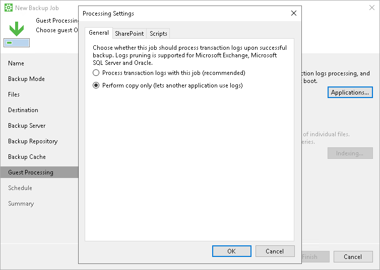

# Copy Only Backup

Some organizations prefer to back up Microsoft SQL Server databases and transaction logs with native Microsoft SQL Server tools or 3rd party backup tools. To restore database systems in a proper way, database administrators must be sure that they have database backups and a sequence of transaction log backups associated with these backups at hand.

If you use native Microsoft SQL Server tools or 3rd party backup tools and also want to back up a machine that runs Microsoft SQL Server with Veeam Agent for Microsoft Windows, you must enable the Perform copy only option in the backup job settings.

The Perform copy only option indicates that a chain of database backups is created with native Microsoft SQL Server means or by a 3rd party tool, and instructs Veeam Agent to preserve this chain (backup history). If the Perform copy only option is enabled, Veeam Agent produces the backup of the Copy Backup type that is independent of the existing chain of database backups and does not contain transaction log data. As a result, the backup does not change the log sequence number and transaction log backup time. To learn more about Copy Backup and other VSS backup types, see [Microsoft documentation](https://docs.microsoft.com/en-us/windows/win32/vss/vss-backup-state).

|  |
| --- |
|  IMPORTANT |
| Consider the following:   * Veeam Agent for Microsoft Windows does not truncate transaction logs after copy-only backup. For this reason, if you instruct the backup job to perform copy-only backup, you cannot specify transaction log handing settings for this job. * Veeam Agent for Microsoft Windows supports one transaction log backup job per Veeam Agent computer. If you plan to configure several backup jobs using Veeam Agent for Microsoft Windows, you can enable database log backup settings for one job only. |

