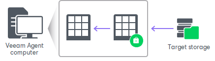

# How Data Decryption Works

When you restore data from an encrypted backup file, Veeam Agent performs data decryption automatically in the background or requires you to provide a password.

* If encryption keys required to unlock the backup file are available in the Veeam Agent database, you do not need to enter the password. Veeam Agent uses keys from the database to unlock the backup file. Data decryption is performed in the background, and data restore does not differ from that from an unencrypted one.

Automatic data decryption can be performed in one of the following situations:

* You encrypt and decrypt the backup file on the same Veeam Agent computer using the same Veeam Agent database.
* You have included encryption keys into the Veeam Recovery Media and perform bare metal recovery after booting from this Veeam Recovery Media. To learn more, see [Specify Recovery Media Options](image_create_options.md).

* If encryption keys are not available in the Veeam Agent database, you need to provide a password to unlock the encrypted file.

Data decryption is performed on the source or target side depending on the backup target. As a result, encryption keys are not passed to the untrusted side, which helps avoid data interception.

In Veeam Agent, the decryption process includes the following steps. Keep in mind that steps 1 and 2 are required only if you decrypt the file on the Veeam Agent computer other than the computer where the file was encrypted.

1. You select the backup from which you want to restore data. Veeam Agent notifies you that one or more files in the backup chain are encrypted and requires a password.
2. You specify a password for the imported file. If the password has changed once or several times, you need to specify the latest password. In Veeam Agent, you can use the latest password to restore data from all restore points in the backup chain, including those restore points that were encrypted with an old password.
3. Veeam Agent reads the entered password and generates the user key based on this password. With the user key available, Veeam Agent performs decryption.

After the encrypted file is unlocked, you can work with it as usual.

