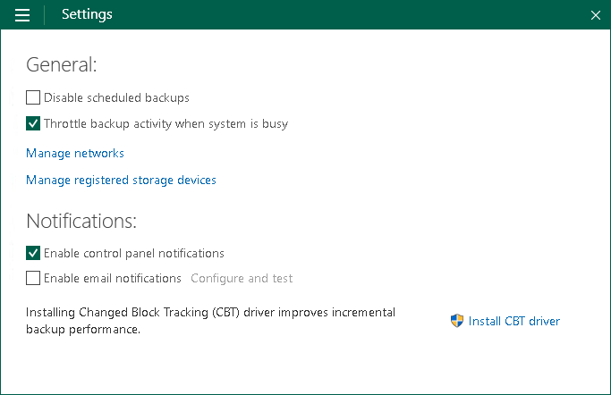

# Disabling and Enabling Scheduled Backups

You can disable scheduled backups if you do not want to run automatic backups for some period of time. For example, you may want to put backup activities on hold if you plan to perform resource consuming operations on your computer at the time when the backup job is scheduled. After the operations are completed, you can enable scheduled backups again.

The disabling option is applicable to backup job sessions started upon schedule. You can create standalone full backups and perform ad-hoc incremental backup even if the scheduled backups are disabled.

The disabling option is applicable to all backup jobs configured in Veeam Agent for Microsoft Windows. If you enable this option, all jobs that you configured will not start automatically upon the defined schedule. If you want to prevent a specific job from starting automatically, disable scheduling options in the properties of this job.

If you configured a backup job that is set up to create database log backups, after you disable scheduled backups, the database log backup job will be disabled, too.

The disabling option does not put on hold the backup cache synchronization process. If Veeam Agent has created one or more backup files in the backup cache, and then the backup target becomes available, Veeam Agent will immediately upload backup files to the target location.

To disable scheduled backups:

1. Double-click the Veeam Agent for Microsoft Windows icon in the system tray or right-click it and select Control Panel.
2. From the main menu, select Settings.
3. Select the Disable scheduled backups check box.

To enable scheduled backups:

1. Double-click the Veeam Agent for Microsoft Windows icon in the system tray or right-click it and select Control Panel.
2. From the main menu, select Settings.
3. Clear the Disable scheduled backups check box.

