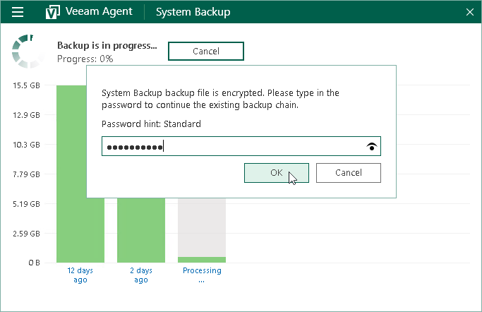

# Continuing Encrypted Backup Chain

In some situations, encryption keys may be unavailable in the Veeam Agent for Microsoft Windows database, and Veeam Agent cannot create a new encrypted restore point in the backup chain. For example, this may happen after you change the password for encryption and then recover the entire Veeam Agent computer to a restore point that was created before you have changed the password. In this case, information about backup in the Veeam Agent database will become outdated and will not match backup metadata residing on the target location. To continue the existing encrypted backup chain, you need to provide the latest password in the Veeam Agent control panel.

When the backup job is started (either manually or upon the defined schedule), Veeam Agent detects the latest encrypted backup created by this job in the target location and displays a window in the Veeam Agent control panel offering to enter a password and continue the backup chain. You can choose to perform one of the following operations:

* To continue the existing encrypted backup chain, you can enter the password specified for encryption and click OK. If the password has changed more than once, you need to specify the latest password.

After you provide the correct password, Veeam Agent will use this password to decrypt backup metadata on the target location and update information about backup in its database. After that, Veeam Agent will create the new incremental backup file in the existing encrypted backup chain. To encrypt this backup file and subsequent backup files, Veeam Agent will use the password that is kept in its database at the time when continue the backup chain.

You will be able to use this password to restore data from any restore point in the backup chain, including restore points that were encrypted with an older password and restore points that were created before you have enabled the encryption option for the job.

* You can click Cancel to close the notification window and cancel the job. In this case, the next time the backup job is started, Veeam Agent will again prompt to enter the password.

|  |
| --- |
|  NOTE |
| Veeam Agent for Microsoft Windows displays the notification window for 1 hour. If you do not choose any option, after this time period expires, Veeam Agent will automatically close the window and cancel the job. If email notification settings are enabled for the backup job, Veeam Agent will also send an email report informing that the job was canceled. |

