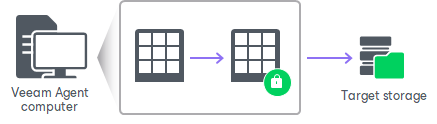

# How Data Encryption Works

Data encryption is performed as part of the backup process. Encryption works at the source or target side depending on the backup target. As a result, encryption keys are not passed to the untrusted side, which helps to avoid data interception.

The source side encryption is performed at the [job](#job) level. The target side encryption is performed at the [storage](#storage) level.

Job encryption

Encryption for the backup job is configured in the [backup job storage settings](backup_job_advanced_storage.md). You should enable the encryption option and specify a password to protect data in backup files produced by the backup job.

When you enable encryption for a job, you must define a password to protect data processed by this job, and define a hint for the password. The password and the hint are saved in the job settings. Based on this password, Veeam Agent generates a user key.

The backup job processing with encryption enabled includes the following steps:

1. You enable encryption for the backup job and specify a password.
2. Veeam Agent generates the necessary keys to protect backup data.
3. Veeam Agent encrypts data blocks and transfers them to the target location already encrypted.
4. On the target storage, encrypted data blocks are stored in a resulting backup file.

To guarantee the flawless process of data encryption and decryption, consider the following advice:

Password

1. Use strong passwords that are hard to crack or guess. Consider the following recommendations:

1. The password must be at least 8 characters long.
2. The password must contain uppercase and lowercase characters.
3. The password must be a mixture of alphabetic, numeric and punctuation characters.
4. The password must significantly differ from the password you used previously.
5. The password must not contain any real information related to you, for example, date of birth, your pet’s name, your logon name and so on.

1. Provide a meaningful hint for the password that will help you recall the password. The hint for the password must significantly differ from the password itself. The hint for the password is displayed when you select an encrypted backup server and attempt to unlock it.
2. Change passwords for encrypted jobs regularly. Use of different passwords helps increase the encryption security level.

Encryption for Existing Job

If you enable encryption, during the next job session Veeam Agent will automatically create a full backup file. The created full backup file and subsequent incremental backup files in the backup chain will be encrypted with the specified password.

If you change the password for the already encrypted job, during the next job session Veeam Agent will create a new incremental backup file. The created backup file and subsequent backup files in the backup chain will be encrypted with the new password.

If you disable encryption, during the next job session Veeam Agent will automatically create a full backup file.

Storage encryption

You cannot specify encryption options for the backup job if you have chosen to save Veeam Agent backups in a Veeam backup repository. For such jobs, encryption options are managed per repository by a backup administrator working with Veeam Backup & Replication. To learn more, see the [Encrypting Standalone Application Backups in Backup Repositories](https://helpcenter.veeam.com/docs/vbr/userguide/encrypting_backups.html?ver=13) section in the Veeam Backup & Replication User Guide.

