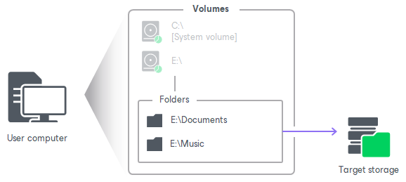
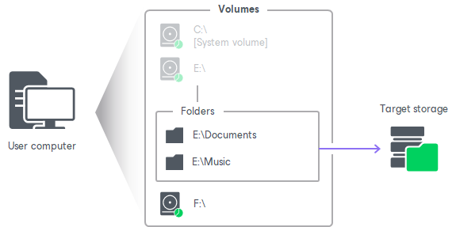

# File-Level Backup

You can set up Veeam Agent for Microsoft Windows to create a file-level backup. The file-level backup captures only data of individual folders on the computer. You can use the file-level backup to restore files and folders that you have added to the backup scope.

Veeam Agent lets you create two types of file-level backups:

* You can include individual folders into the backup. When you recover from such backup, you will be able to restore folders that you have selected to back up, and files in these folders.

* You can create a hybrid backup that will include folders and specific computer volumes. When you recover from such backup, you will be able to restore the following components:

* For backed-up volume: the entire volume and individual files and folders on this volume.
* For backed-up folders: folders that you have selected to back up, and files in these folders.

Related Tasks

* [Selecting Folders to Back Up](backup_job_folders.md)

