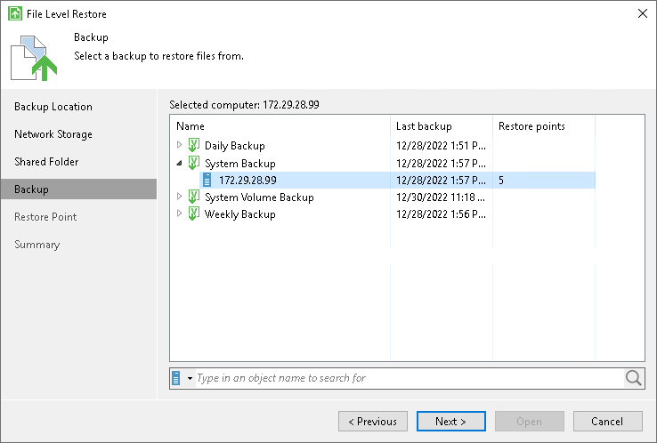

# Step 5. Select Backup

The Backup step of the wizard is available if you have chosen to restore data from a backup file that resides in a remote location — in object storage, in a network shared folder, in a backup repository or in a cloud repository.

From the list of backups, select a backup from which you want to recover data. To quickly find the necessary backup, use the search field at the bottom of the window: enter a backup name or a part of it in the search field and click the Start search button on the right or press [ENTER].

If you restore data from a backup stored in the backup repository, Veeam Agent for Microsoft Windows displays only those backups that are accessible by the user whose credentials are specified at the [Backup Server](files_restore_vbr.md) step of the wizard:

* If you specify credentials for the user who has access to the backup repository, the list of backups will include only backups created by this user.
* If you specify credentials for the user who is assigned the Backup Administrator or Restore Operator role on the backup server, the list of backups will include all Veeam Agent backups stored in the backup repository.

If you restore data from a backup stored in the cloud repository, Veeam Agent for Microsoft Windows displays only those backups that are accessible by the user whose credentials are specified at the [Credentials](files_restore_sp.md#creds) step of the wizard:

* If you specify credentials for the tenant account, the list of backups will include backups created by all users who create backups under this account.
* If you specify credentials for the subtenant account, the list of backups will include only those Veeam Agent backups that were created under this subtenant account.

|  |
| --- |
|  NOTE |
| If you restore data from an encrypted backup that was created on another Veeam Agent computer, you need to provide a password to unlock the encrypted file. To learn more, see [Restoring Data from Encrypted Backups](restore_encrypted.md). |

