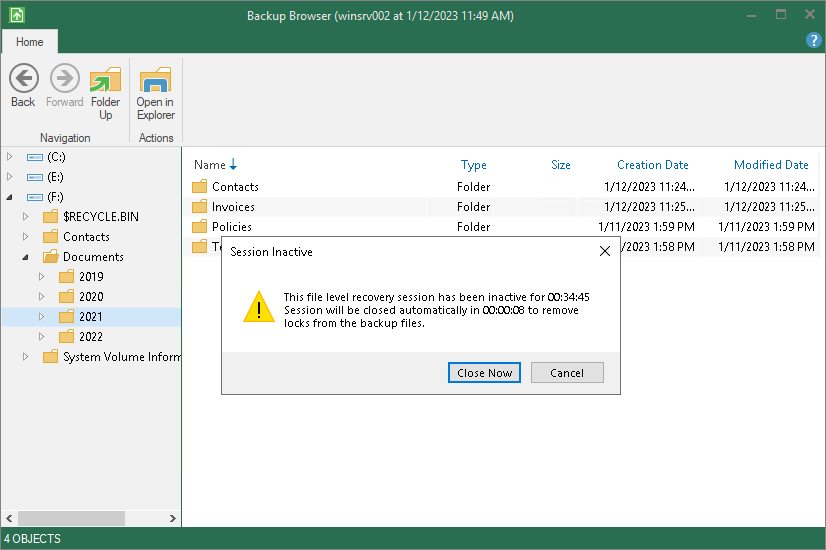

# Closing Veeam Backup Browser

You can browse restored files and folders only while the Veeam Backup browser is open. After the Veeam Backup browser is closed, Veeam Agent for Microsoft Windows unmounts the backup content from your computer.

We recommend that you close the Veeam Backup browser after you finish restoring files and folders. Every 5 minutes, Veeam Agent for Microsoft Windows checks if there is any activity in the Veeam Backup browser. If the user or product components and services have not performed any actions for 30 minutes, Veeam Agent for Microsoft Windows displays a warning that the Veeam Backup browser is to be closed within 5 minutes.

After the warning is displayed, you can perform one of the following actions:

* You can close the Veeam Backup browser manually.
* You can click Cancel to postpone the close operation. In this case, the Veeam Backup browser will remain open for 30 minutes. After this period expires, Veeam Agent for Microsoft Windows will display the warning again.
* You can perform no action at all. In this case, the Veeam backup browser will be automatically closed in 5 minutes.

