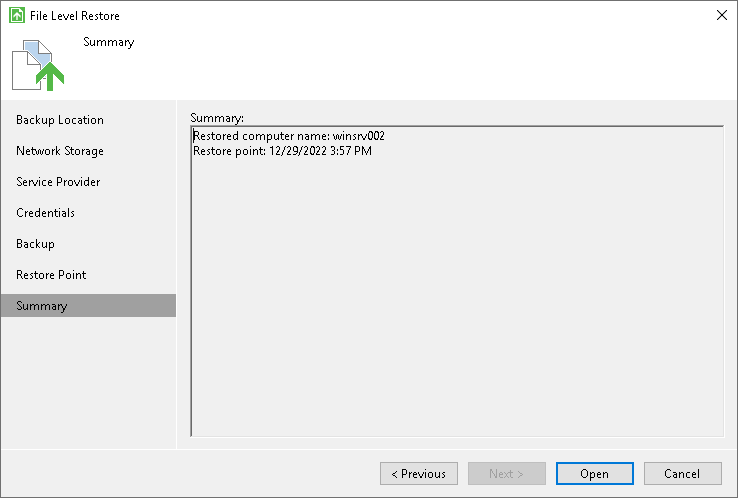

# Step 7. Verify Restore Settings

At the Summary step of the wizard, review the restore settings and click Open. Veeam Agent for Microsoft Windows will retrieve the content of the backup file, publish it directly into the file system of your computer and display it in the Veeam Backup browser.

