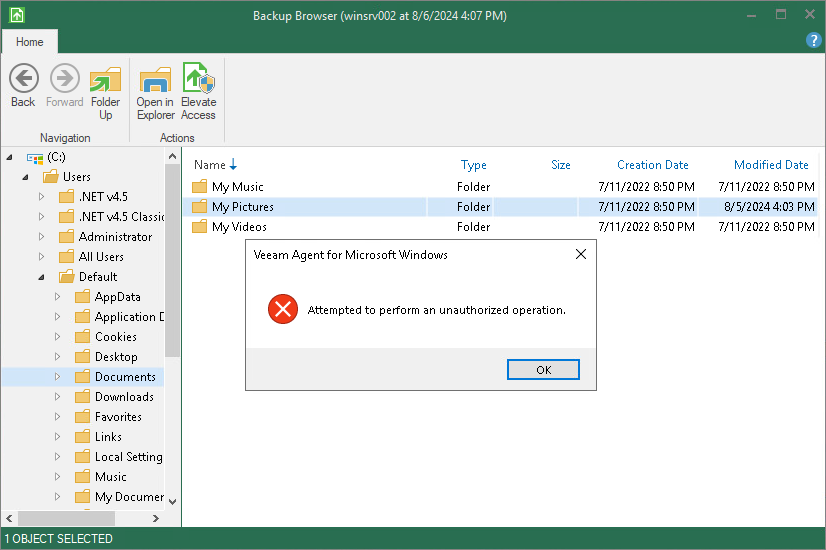
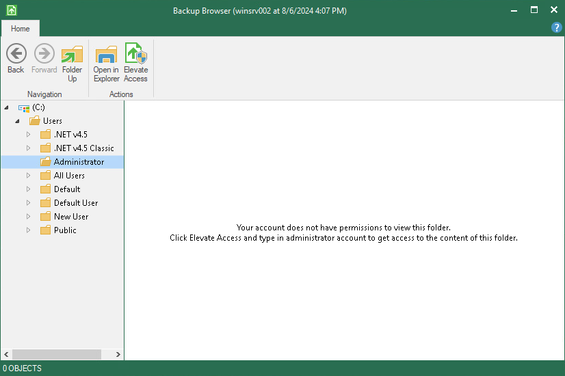

# Elevating Access Rights

If you work under an account that does not have administrative privileges, you might not have access rights to restore the files you need. For example, this can happen in the following situations:

* You are trying to restore files to a folder you do not have access to.

* You are trying to select a file or a folder to restore from a location you do not have access to.

|  |
| --- |
| NOTE |
| You can open the Veeam Backup browser under an account without administrative privileges only if the backup is stored in a Veeam backup repository or Veeam Cloud Connect repository. |

In these cases, you can switch to the Administrator account with the Veeam Backup browser. To change the user, do the following:

1. Open the File Level Restore wizard from the Veeam Agent control panel.
2. In the Veeam Backup browser, click Elevate Access on the toolbar.

Keep in mind that Veeam Agent displays the Elevate Access button only if you work under an account without administrative privileges. To allow users without administrative privileges to open the Veeam Backup browser and restore from the file-level backup, do one of the following:

* If Veeam Agent operates in the standalone mode, use a registry value. For more information, [contact Veeam Customer Support](support_report.md).
* If Veeam Agent operates in the managed mode, use the Veeam Backup & Replication console. For more information, see the [Veeam Agent for Microsoft Windows Settings](https://helpcenter.veeam.com/docs/vbr/userguide/agents_protection_group_advanced_vaw.html?ver=13) section in the Veeam Backup & Replication User Guide.

1. In the dialog window, provide administrator credentials.

After that, Veeam Agent will restart the Veeam Backup browser with the updated access rights.

