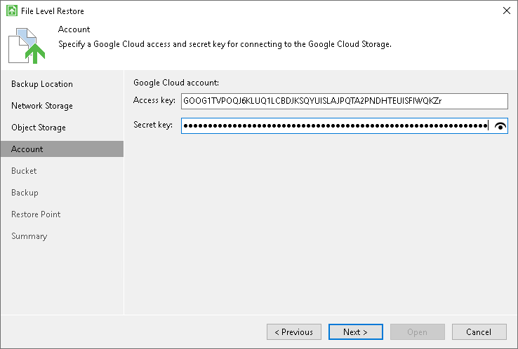
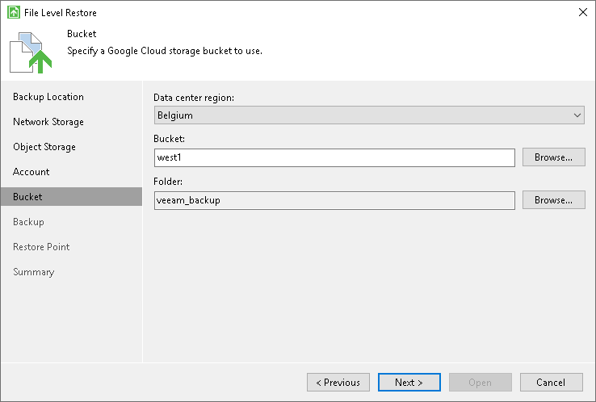

# Google Cloud Storage Settings

If you have selected to restore data from a backup file located in the Google Cloud storage, specify the following settings:

1. [Specify account settings](#storage).
2. [Specify bucket settings](#bucket).

Specifying Account Settings

The Account step of the wizard is available if you have chosen to restore data from a backup file located in object storage.

To connect to the Google Cloud storage, in the Access key and Secret key fields, specify the Hash-based Message Authentication Code (HMAC) keys associated with the Google Cloud account. Veeam Agent will use the HMAC keys to authenticate requests to the Google Cloud storage. For more information on Google Cloud accounts, see [Google Cloud documentation](https://cloud.google.com/iam/docs/creating-managing-service-accounts#creating_a_service_account).

Specifying Bucket Settings

The Bucket step of the wizard is available if you have chosen to restore data from a backup file located in object storage and specified account settings to connect to the storage.

Specify settings for the bucket in the storage:

1. From the Data center region drop-down list, select the geographic region where the backup file is stored.
2. In the Bucket field, specify a bucket in the storage:

1. Select the Browse option.
2. In the Select Bucket window, do the following:

1. Double-click the region name or click the arrow to the left of the region name to view the list of available buckets.
2. Select the necessary bucket and click OK.

1. In the Folder field, specify a folder in the bucket:

1. Select the Browse option.
2. In the Select Folder window, do the following:

1. Double-click the bucket name or click the arrow to the left of the bucket name to view the list of available folders.
2. Select the necessary folder and click OK.

