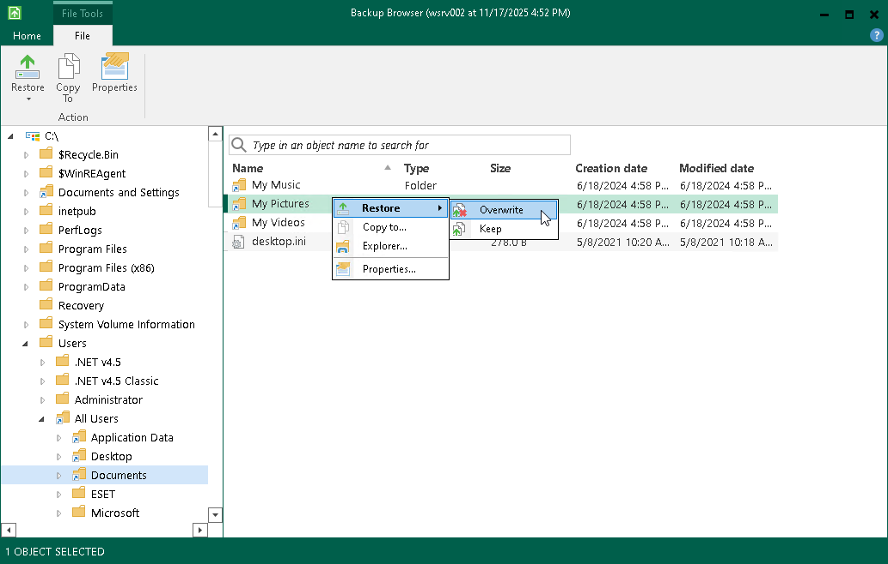

# Saving Files to Initial Location

To save restored files or folders to their initial location, right–click the necessary item in the file system tree or in the details pane on the right and select one of the following commands:

* To overwrite the original item on your computer with the item restored from the backup, select Restore > Overwrite.
* To save the item restored from the backup next to the original item on your computer, select Restore > Keep. Veeam Agent for Microsoft Windows will add the RESTORED- prefix to the restored file or folder name and save it in the same location where the original file resides.

