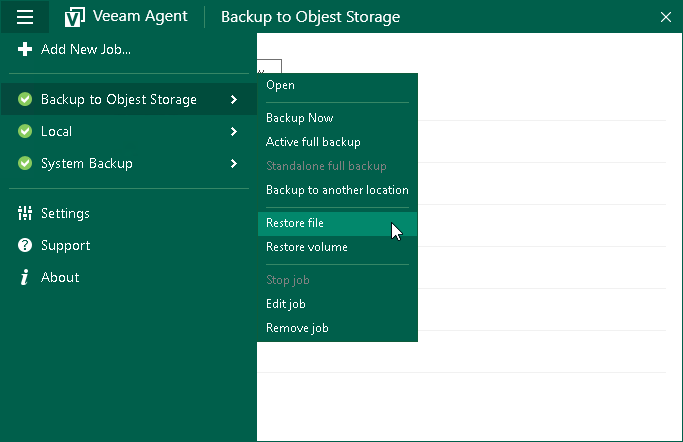

# Step 1. Launch File Level Restore Wizard

To launch the File Level Restore wizard, do either of the following:

* Right-click the Veeam Agent for Microsoft Windows icon in the system tray and select Restore > Individual files.

* Double-click the Veeam Agent for Microsoft Windows icon in the system tray or right-click the icon and select Control Panel. In the control panel, click a bar of the necessary backup job session. Click Restore Files at the bottom of the window. Veeam Agent for Microsoft Windows will automatically publish the backup content into the computer file system and [open the Veeam Backup browser](files_restore_save.md).

* Double-click the Veeam Agent for Microsoft Windows icon in the system tray or right-click the icon and select Control Panel. In the main menu, hover over the name of the job that that created the backup from which you want to restore data, and select Restore file.

* From the Microsoft Windows Start menu, select All Programs > Veeam > File Level Restore.

