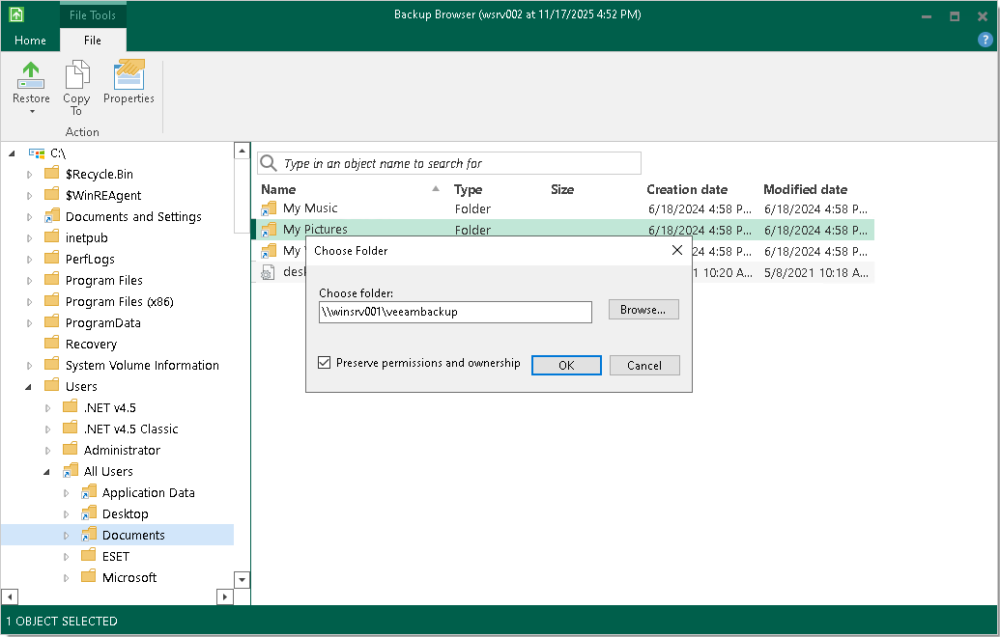

# Saving Files to New Location

To save restored files or folders to your computer or to a network shared folder, right-click the necessary item in the file system tree or in the details pane on the right and select Copy To.

When restoring file objects, you can choose to preserve their original NTFS permissions:

* Select the Preserve permissions and ownership check box to keep the original ownership and security permissions for restored items. Veeam Agent for Microsoft Windows will copy selected files or folders with associated Access Control Lists, preserving granular access settings.

If access settings of a file or folder that you want to restore are inherited from a parent folder, when you restore this file or folder without the parent folder, its access settings will not be preserved.

* Leave the Preserve permissions and ownership check box not selected if you do not want to preserve the original ownership and access settings for restored items. Veeam Agent for Microsoft Windows will change security settings: the user who launched the Veeam Agent for Microsoft Windows will be set as the owner of the restored items. Access permissions will be inherited from the folder to which the restored items are copied.

