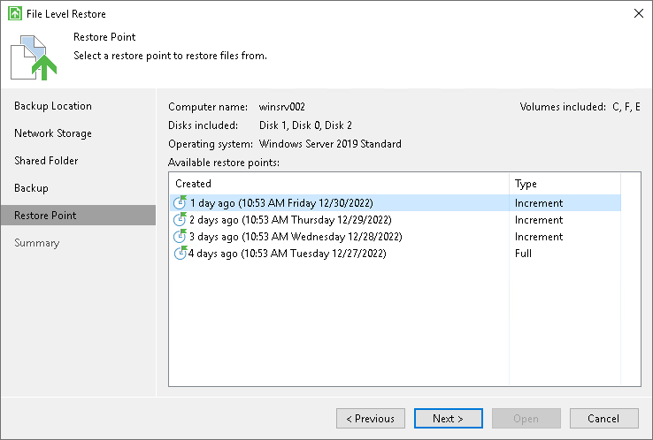

# Step 6. Select Restore Point

At the Restore Point step of the wizard, select a restore point from which you want to recover data.

By default, Veeam Agent for Microsoft Windows uses the latest restore point. However, you can select any valid restore point to recover files and folders to a specific point in time.

