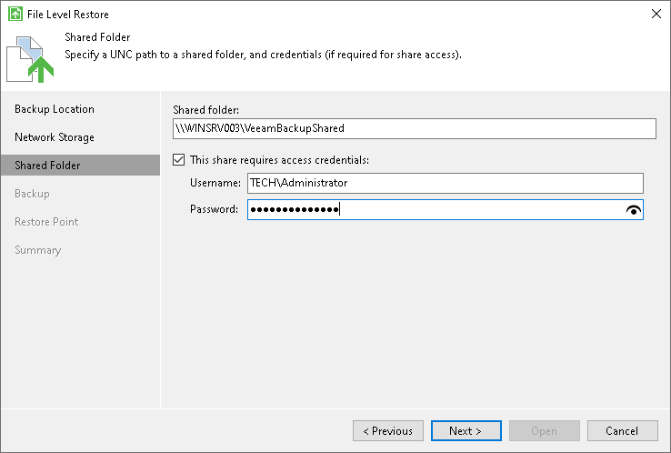

# Shared Folder Settings

The Shared Folder step of the wizard is available if you have chosen to restore data from a backup file located in a network shared folder.

Specify settings for the network shared folder:

1. In the Shared folder field, type in a UNC name of the network shared folder with the backup file. Keep in mind that the UNC name always starts with two back slashes (\\).
2. If the network shared folder requires authentication, select the This share requires access credentials check box and specify a user name and password of the account that has Full Control access permissions on this shared folder. The user name must be specified in the [down-level logon name](https://docs.microsoft.com/en-us/windows/win32/secauthn/user-name-formats#down-level-logon-name) format. For example, DOMAIN\UserName or HOSTNAME\UserName.

If you do not select the This share requires access credentials check box, Veeam Agent for Microsoft Windows will connect to the shared folder using the NT AUTHORITY\SYSTEM account of the computer where the product is installed.

1. To view the entered password, click and hold the eye icon on the right of the Password field.

