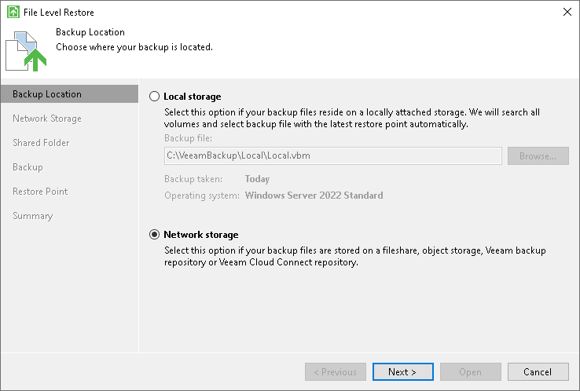

# Step 2. Specify Backup File Location

At the Backup Location step of the wizard, specify where the backup file that you plan to use for restore resides.

If you configured only one backup job, Veeam Agent automatically locates the latest backup of this backup job on the target storage, and you pass immediately to the [Restore Point](files_restore_point.md) step of the wizard. If there are several backup jobs configured or Veeam Agent fails to locate the backup for some reason, specify where the backup file resides:

* Local storage — select this option if the backup file resides on the computer drive, external drive or removable storage device that is currently connected to your computer. Click Browse and select a backup metadata file (VBM).
* Network storage — select this option if the backup file resides in object storage, in a network shared folder, in a backup repository managed by a Veeam backup server or in a cloud repository exposed to you by a Veeam Cloud Connect service provider. In this case, the File Level Restore wizard will include additional steps for specifying the backup file location settings.

