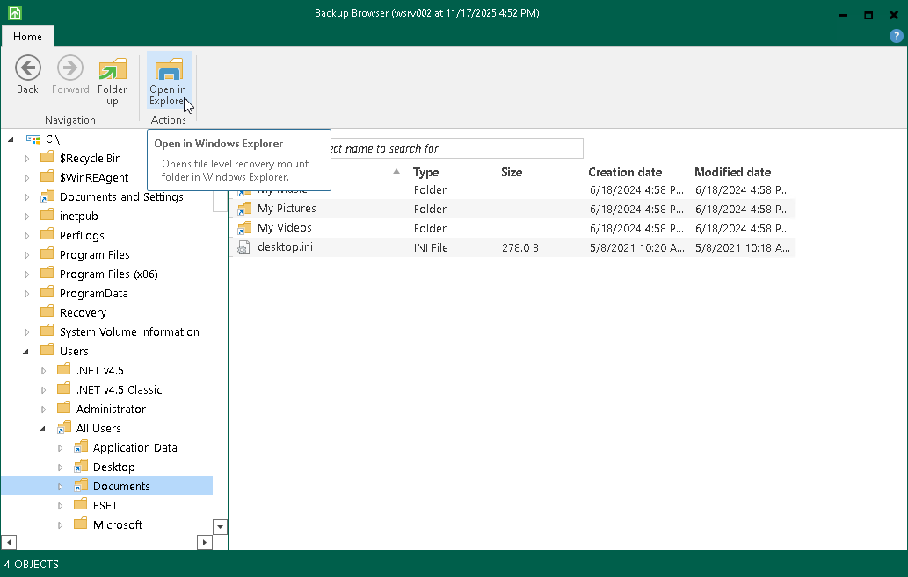

# Working with Windows Explorer

You can use Microsoft Windows Explorer to work with restored files and folders. To do this, do either of the following:

* In Veeam Backup browser, select the necessary file or folder and click Open in Explorer on the toolbar. Veeam Agent for Microsoft Windows will open the selected folder or file in Microsoft Windows Explorer.
* Open Microsoft Windows Explorer and browse for restored files and folders. The backup content is mounted under the C:\VeeamFLR\ServerName folder.

We recommend that you use the Veeam Backup browser instead of Microsoft Windows Explorer for file-level restore. Use of the Veeam Backup browser has the following advantages:

1. You can browse the guest OS file system ignoring the file system ACL settings.
2. You can preserve permissions and ownership during file-level restore.

If you open the file system through the Microsoft Windows Explorer, these capabilities will not be available.

To learn more, see SeBackupPrivilege and SeRestorePrivilege in [Microsoft documentation](https://learn.microsoft.com/en-us/windows/win32/secauthz/privilege-constants).

