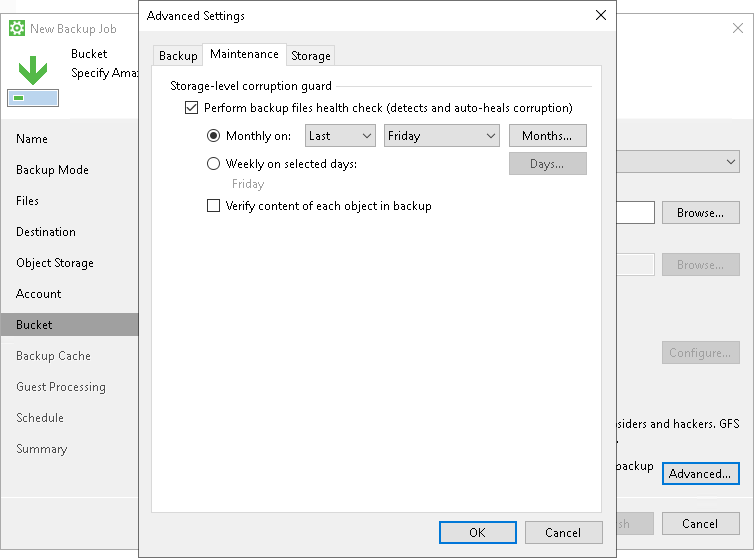
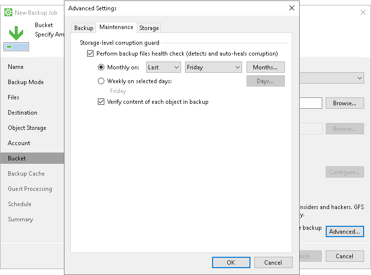

# Health Check for Object Storage

For backup jobs targeted at object storage, Veeam Agent offers a special health check mechanism that differs from the standard health check in the following ways:

* The health check for object storage verifies metadata for the whole backup, not just the latest restore point.
* The health check for object storage does not read data from data blocks; it only lists data blocks to make sure all blocks in the storage are available for rebuilding every restore point in the backup chain.

The health check for object storage works faster than the standard health check and helps save traffic.

|  |
| --- |
| NOTE |
| The health check mechanism described in this section is only available for object storage targets. |

To run the special health check for object storage periodically, select the Perform backup files health check check box in the backup job settings and define the health check schedule. Make sure that the Verify content of each object in backup check box is not selected.

If necessary, you can enable the standard health check mechanism for object storage targets. To do so, select the Verify content of each object in backup check box in the backup job settings. Keep in mind that enabling this setting may result in additional charges from your object storage provider.

How Health Check for Object Storage Works

Veeam Agent performs the health check of a backup in the following way:

1. During the backup job session after a new incremental backup file is created, Veeam Agent starts the health check of the whole backup. Veeam Agent checks if the metadata of the backup is consistent and no metadata is missing. Veeam Agent also checks if all data blocks for every restore point are available in the storage. Veeam Agent does not read data from data blocks.
2. If Veeam Agent does not find any corrupted data, the health check completes successfully.

If Veeam Agent detects corrupted data, the health check completes with an error. Depending on the detected data inconsistency, Veeam Agent behaves in one of the following ways:

* If the health check detects corrupted metadata, Veeam Agent marks the backup as corrupted in the Veeam Agent configuration database; the backup job session fails. During the next scheduled or manual backup job session, Veeam Agent will create a full backup and will start a new backup chain. The corrupted backup will become orphaned and will remain in the repository — you can keep or delete it.
* If the health check detects corrupted data blocks in the latest restore point in the backup chain, Veeam Agent launches the health check retry.

During the health check retry, Veeam Agent restarts the backup job to create a new restore point and transports data blocks from the Veeam Agent computer including the blocks that contain corrupted data and the blocks that have changed since the backup job session that has triggered the health check. Veeam Agent will not perform another health check after the job retry is finished; the next health check will run according to the defined schedule during another incremental backup job session.

* If the health check detects corrupted data blocks in an inactive backup chain, Veeam Agent does not launch the health check retry. Veeam Agent marks the backup and all related restore points as corrupted. The backup job session ends with a warning message.

You can view the health check result in the restore point statistics. If the health check finds corrupted data, it will display information on where corrupt data has been detected — in metadata or blockstore, as well as list all restore points that share the corrupted data blocks.

|  |
| --- |
| NOTE |
| Consider the following:  In case of immutable backups, Veeam Agent performs the health check only for valid restore points according to the retention policy. Immutable data associated with removed restore points can still remain in the repository depending on the immutability period, but Veeam Agent will not perform the health check for such data.  For information about backup immutability settings, see [Backup Immutability](backup_immutability.md). |

