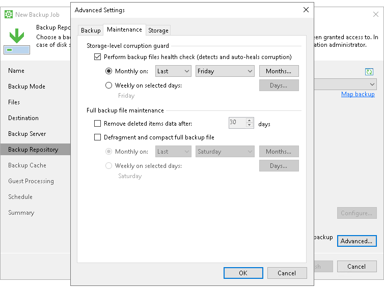
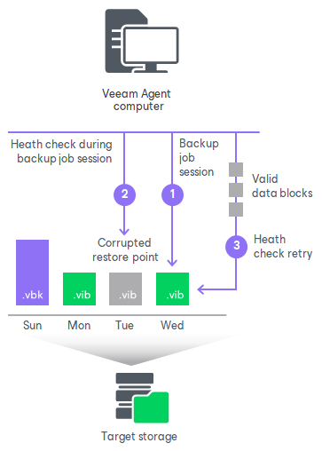

# Standard Health Check

During the standard health check, Veeam Agent performs a CRC check for metadata and a hash check for data blocks in the backup file to verify their integrity. The health check helps make sure that the restore point is consistent, and you will be able to restore data from this restore point.

You can use the standard health check for all backup targets.

|  |
| --- |
| NOTE |
| Keep in mind that for the object storage targets, Veeam Agent offers another health check mechanism as default. To learn more, see [Health Check for Object Storage](health_check_object_storage.md). |

To run the standard health check periodically, enable the Perform backup files health check option in the backup job settings and define the health check schedule.

How Standard Health Check Works

When Veeam Agent for Microsoft Windows saves a new restore point to the backup location, it calculates CRC values for backup metadata and hash values for data blocks in the backup file, and saves these values in the metadata of the backup file, together with the backed-up data. During the health check session, Veeam Agent uses these values to make sure that a verified restore point is consistent.

|  |
| --- |
| NOTE |
| If the backup job is targeted at a Veeam backup repository or cloud repository, and you perform the health check for the encrypted backup files, Veeam Backup & Replication will pass encryption keys to the Veeam backup repository or cloud repository. For more information on encryption, see [Data Encryption](data_encryption.md). |

Veeam Agent for Microsoft Windows performs the health check in the following way:

1. During the backup job session, Veeam Agent for Microsoft Windows creates a new restore point in the backup chain.
2. At the end of the backup job session, Veeam Agent for Microsoft Windows performs the health check. It calculates CRC values for backup metadata and hash values for data blocks in the backup file and compares them with the CRC and hash values that are already stored in the backup file.

During the health check, Veeam Agent for Microsoft Windows verifies the latest restore point in the backup chain (restore point created with the current backup job session — the session during which the health check is performed). If the latest restore point in the backup chain is incomplete (for example, if the current backup job session completed with an error), Veeam Agent checks the restore point preceding the latest one.

If the health check does not detect data corruption, the backup job session completes in a regular way.

1. If the health check detects corrupted data, Veeam Agent for Microsoft Windows completes the backup job with the Error status and starts the health check retry process. The health check retry starts as a separate backup job session.

Depending on the revealed data corruption, Veeam Agent performs the following actions:

+ If the health check detects corrupted backup metadata in the full backup file, Veeam Agent marks the backup chain starting from this full restore point as corrupted in the Veeam Agent for Microsoft Windows database. During the health check retry, Veeam Agent transports the entire data selected for backup from the Veeam Agent Computer, creates a new full backup file in the target location and saves transported data blocks to this backup file.
+ If the health check detects corrupted backup metadata in the incremental backup file, Veeam Agent removes information about this incremental restore point and subsequent incremental restore points from the Veeam Agent for Microsoft Windows database. During the health check retry, Veeam Agent transports incremental data relatively to the latest valid restore point in the backup chain from the Veeam Agent computer, creates a new incremental backup file in the target location and saves transported data blocks to this backup file.
+ If the health check detects corrupted data blocks in the full or incremental backup file, Veeam Agent marks the restore point that includes the corrupted data blocks and subsequent incremental restore points as corrupted in the Veeam Agent for Microsoft Windows database. During the health check retry, Veeam Agent transports data blocks from the Veeam Agent computer. In addition, Veeam Agent transports data blocks that have changed since the backup job session that has triggered the health check. Veeam Agent stores these data blocks to the latest restore point that has been created with the current backup job session (session that has triggered the health check retry).

You can view the health check result in the restore point statistics. If the health check finds corrupted data, it will display information on where corrupt data has been detected — in metadata or blockstore, as well as list all restore points that share the corrupted data blocks.

