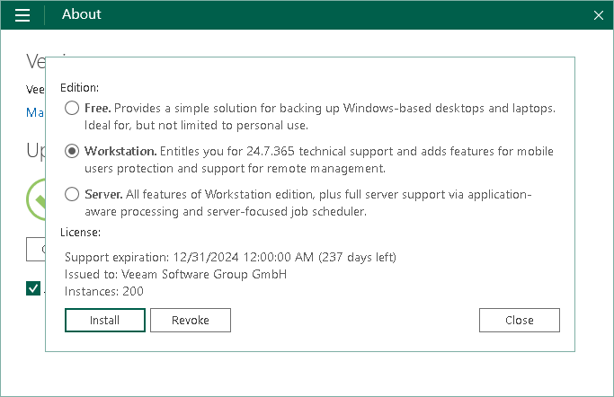
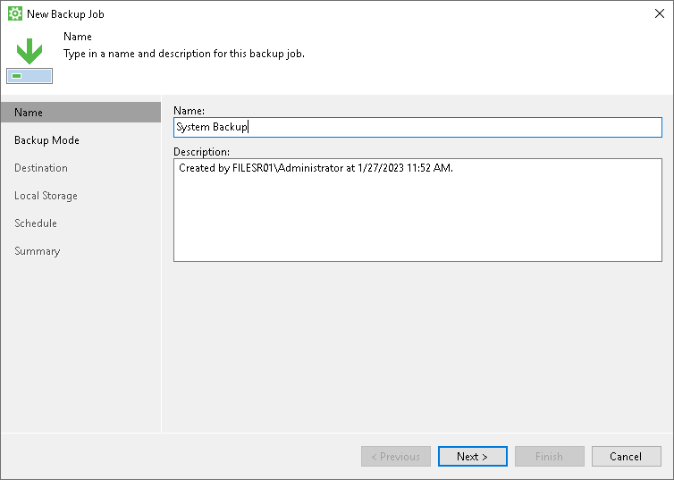
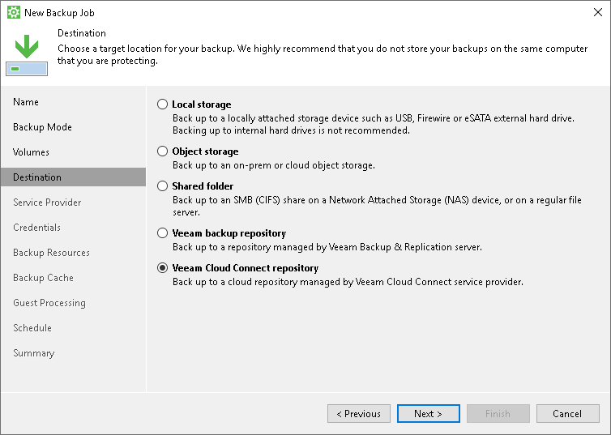
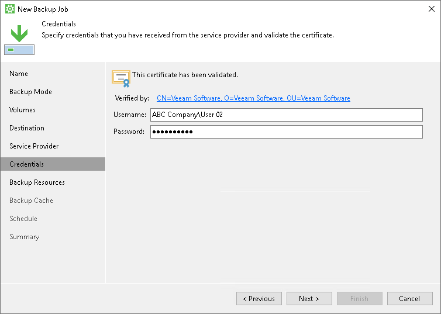
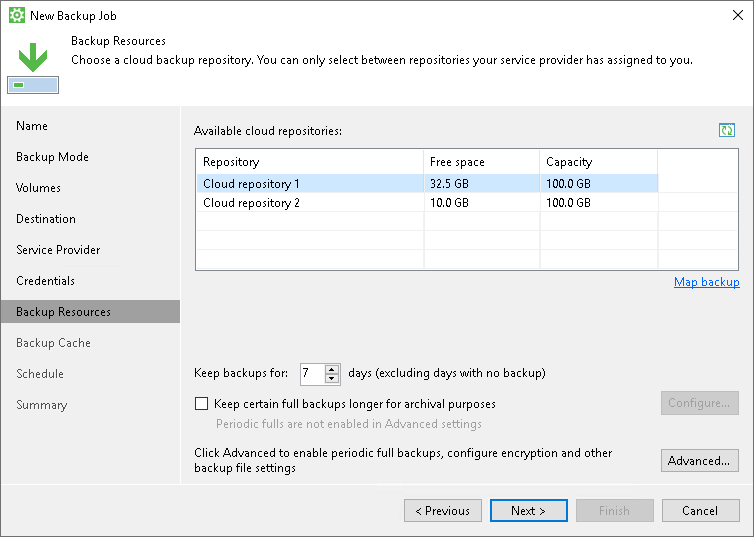
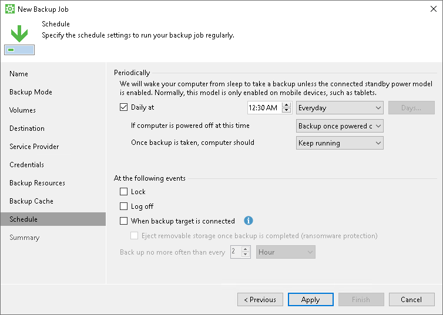

# How to Perform Backup to Cloud Repository

To store a copy of your data in a remote location, you can set up the Veeam Agent backup job to create backups in a Veeam Cloud Connect repository. Using cloud repository as a target location for backup files lets you keep backed-up data offsite without the need to allocate additional storage resources in your infrastructure. If the system crashes or you lose some files, you can restore the necessary information from the backup in the cloud repository.

Creating backups in a Veeam Cloud Connect repository is available in the Workstation and Server editions of Veeam Agent for Microsoft Windows.

This scenario describes how to set up the backup job to create backups in the Veeam Cloud Connect repository using the Workstation edition of Veeam Agent for Microsoft Windows. You will:

1. [Install a license for the Workstation edition of Veeam Agent for Microsoft Windows](#lic).
2. [Configure the backup job to create backups in the Veeam Cloud Connect repository](#backup).

To install a Veeam Agent for Microsoft Windows license:

1. Double-click the Veeam Agent for Microsoft Windows icon in the system tray, or right-click the Veeam Agent for Microsoft Windows icon in the system tray and select Control Panel.
2. From the main menu in the upper left corner, select About.
3. In the Version section, click the Update license to get additional features link.

1. In the License section, click Install and browse for the LIC file that supports the Workstation edition of Veeam Agent for Microsoft Windows.

1. In the Edition section, make sure that the Workstation option is selected. If not, select this option.

1. Click Close.

To configure the backup job:

1. Right-click the Veeam Agent for Microsoft Windows icon in the system tray and select Configure backup.

1. At the Name step of the wizard, specify the job name and description. Click Next.

1. At the Backup Mode step of the wizard, select what data you want to back up: entire computer, specific computer volumes or individual folders with files. Click Next.

1. If you have selected to perform volume-level or file-level backup, at the Volumes step of the wizard select check boxes next to those objects that you want to include in the backup. Click Next.

1. At the Destination step of the wizard, select Veeam Cloud Connect repository. Click Next.

1. At the Service Provider step of the wizard, enter a full DNS name or IP address of the cloud gateway that the Veeam Cloud Connect service provider or your backup administrator has provided to you. Click Next.

1. At the Credentials step of the wizard, enter the user name and password of the tenant or subtenant account that the Veeam Cloud Connect service provider or your backup administrator has provided to you. The user name of the subtenant account must be specified in the TENANT\SUBTENANT format. Click Next.

1. At the Backup Resources step of the wizard, select a cloud repository where you want to store backups. Specify how many restore points you want to retain. Click Next.

1. At the Backup Cache step of the wizard, click Next.
2. At the Schedule step of the wizard, specify the day and time when the backup job must be started and configure advanced scheduling settings if necessary.

1. Click Apply, then click Finish.

