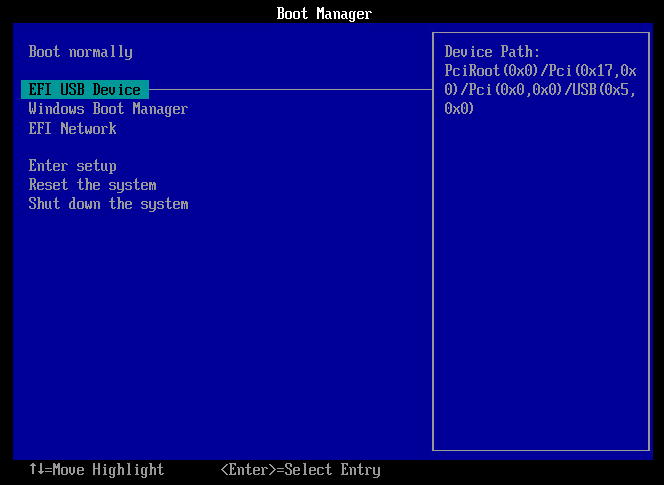
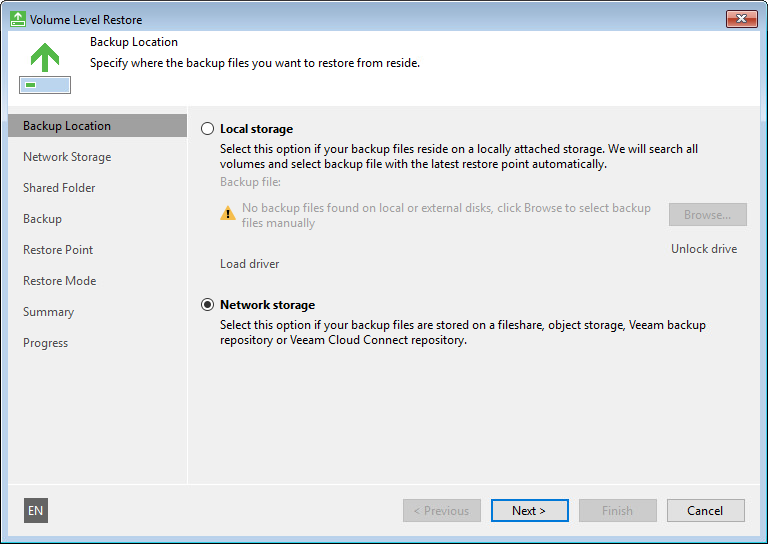
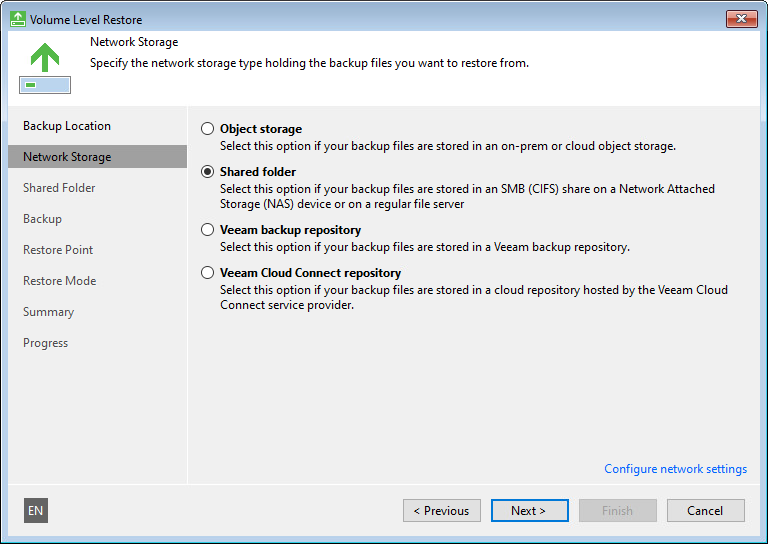
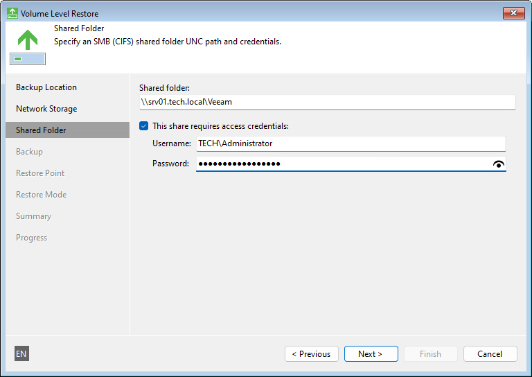
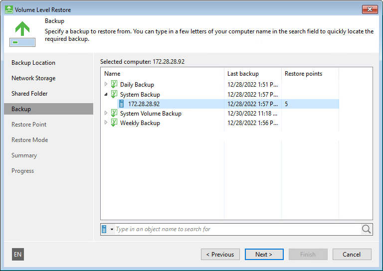
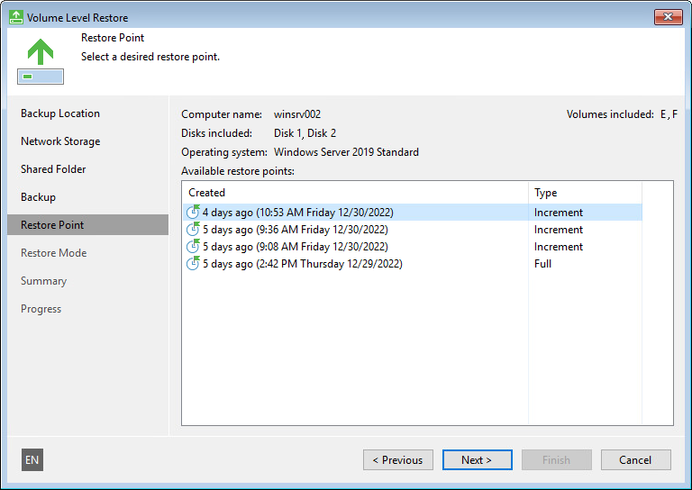
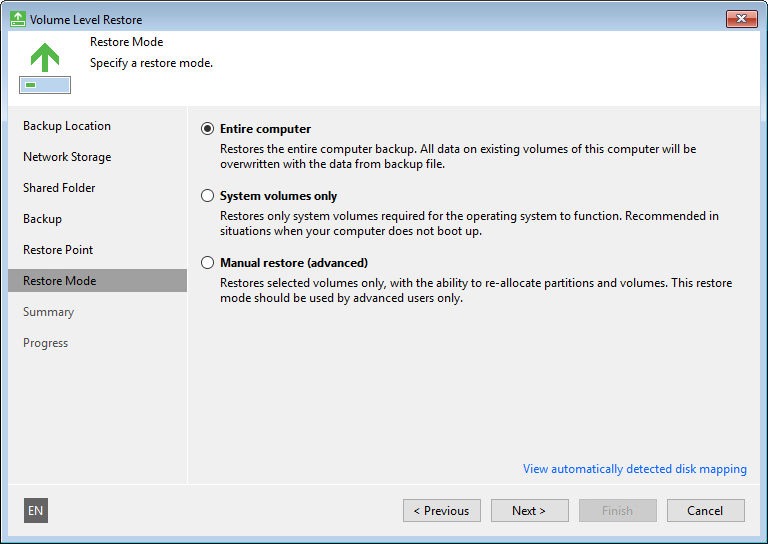

# How to Perform Bare Metal Recovery

To recover the entire computer system on new or existing hardware, you can use bare metal recovery. Bare metal recovery can be helpful in the following cases:

* You want to recover your computer from scratch after a hard failure.
* You want to recover data on a new computer without prior OS installation.

To perform bare metal recovery, you must have the following:

* Veeam Recovery Media — a bootable recovery image.

To learn how to create Veeam Recovery Media, see [Creating Veeam Recovery Media](image_create.md).

* Backup of the computer whose data you want to restore.

To learn how to create a backup, see [Creating Backup Jobs](backup_job_create.md).

This scenario describes how to perform bare metal recovery on the computer without the OS and software installed. For bare metal recovery, we will use the USB bootable drive with the Veeam Recovery Media, and a backup stored in a network shared folder.

1. Power on your computer. Make sure that the USB drive is set as the primary boot source.

1. Insert the bootable USB drive with the Veeam Recovery Media into a USB slot on the computer.
2. Restart the computer. Veeam Agent for Microsoft Windows will load the Microsoft Windows RE from the Veeam Recovery Media.
3. In the Veeam Recovery Media view, click the Network Settings button and select a network over which you want to connect to the shared folder with the backup file. Click OK.

1. In the Veeam Recovery Media view, click Bare Metal Recovery.

1. At the Backup Location step of the wizard, select Network storage. Click Next.

1. At the Network Storage step of the wizard, select Shared folder. Click Next.

1. At the Shared Folder step of the wizard, specify settings of the shared folder where the backup is located. Click Next.

1. At the Backup step of the wizard, select the necessary backup in the shared folder. Click Next.

1. At the Restore Point step of the wizard, select a restore point from which you want to restore data. Click Next.

1. At the Restore Mode step of the wizard, select Entire computer.

1. Click Next, then click Restore to start the data recovery process.
2. Once restore is completed, click Finish to close the wizard.
3. Reboot the computer.

