# How to Protect Windows Computer

To protect information on your computer, you can set up the backup job in Veeam Agent for Microsoft Windows. The backup job runs automatically by schedule, captures data added to the backup scope and creates data backups on the backup target — an external drive, shared folder, Veeam backup repository or Veeam Cloud Connect repository. If the system crashes or you lose some files, you can restore the necessary information from the backup.

In addition to protecting data on your computer, you can protect the OS against failures. You can create the Veeam Recovery Media — a bootable recovery image. If the OS on the computer fails to boot, you can boot it from an alternative source — the Veeam Recovery Media, diagnose and fix problems, or restore data that you need from the backup.

This scenario describes how to protect your computer with the Free edition of Veeam Agent for Microsoft Windows. You will:

1. [Install Veeam Agent for Microsoft Windows](howto_protect_computer.md#install).
2. [Create a Veeam Recovery Media on the USB drive](howto_protect_computer.md#media).
3. [Configure the backup job to create regular backups on the local drive](howto_protect_computer.md#backup).

For scenarios available in commercial versions of Veeam Agent for Microsoft Windows, see [How to Perform Backup to Cloud Repository](howto_backup_to_cloud.md) and [How to Back Up Microsoft SQL Server](howto_sql_backup.md).

To install Veeam Agent for Microsoft Windows:

1. Download the installation archive for Veeam Agent for Microsoft Windows from [this Veeam webpage](https://www.veeam.com/downloads.html).
2. Unpack the archive and run the VeeamAgentWindows\_<version>.exe file.
3. Click Next.
4. To install Veeam Agent for Microsoft Windows, you must accept the following:

* Terms of Veeam License Agreement and licensing policy.
* Each of the license agreements of the 3rd party components used.
* Each of the license agreements of the required software.

Read the agreements and the licensing policy and click the I Accept button.

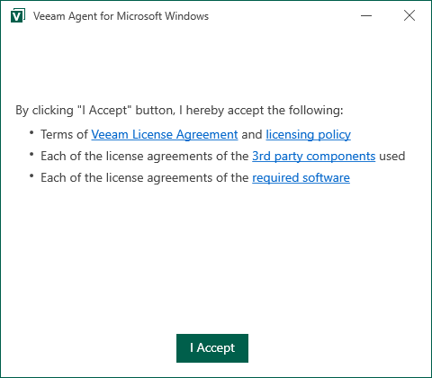

1. Wait for the installation process to complete.
2. At the next step of the wizard, make sure that the Run Veeam Recovery Media creation wizard check box is selected. Click Finish.

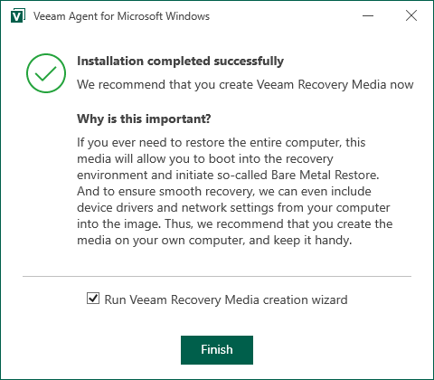

When installation completes, Veeam Agent for Microsoft Windows will launch the Create Recovery Media wizard.

To create a Veeam Recovery Media:

1. Insert a USB drive into a USB slot on the computer.
2. At the top right corner of the Available bootable media types list, click the Refresh icon.
3. Select the connected USB drive. Click Next.

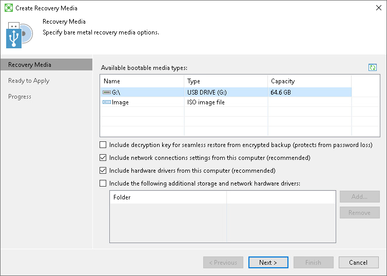

1. Veeam Agent for Microsoft Windows will inform you that the USB drive will be formatted. To confirm the operation, in the displayed window click Yes.
2. At the Ready to Apply step of the wizard, click Create to start the Veeam Recovery Media creation process.

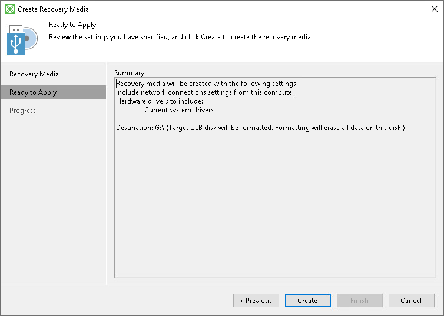

1. Wait for the media to be created. Typically, it takes 2-5 minutes. Then click Finish to exit the wizard.

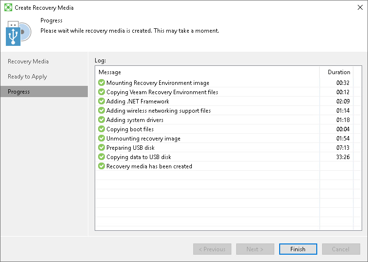

To configure the backup job:

1. Right-click the Veeam Agent for Microsoft Windows icon in the system tray and select Backup > Configure backup.

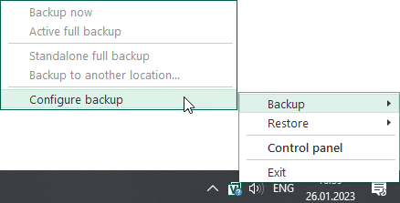

If you do not see the icon, open the Notification Area Icons window in Microsoft Windows and make sure that the Show icon and notifications setting is selected for Veeam Agent Tray.

1. At the Name step of the wizard, specify the job name and description. Click Next.

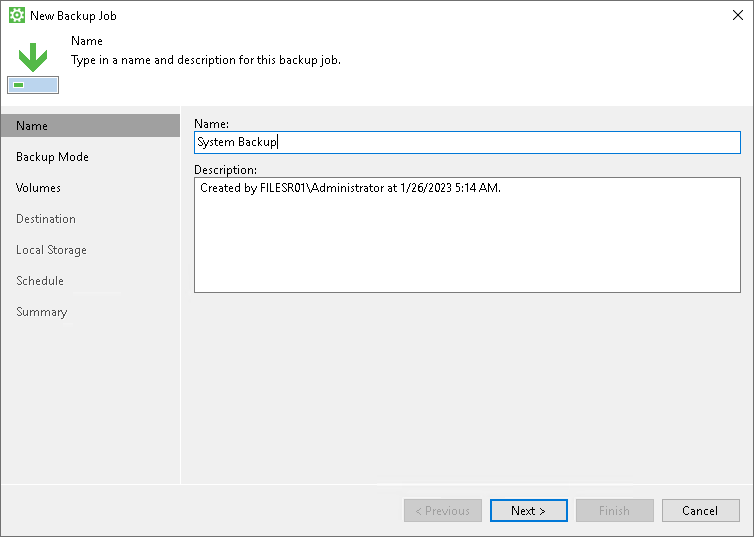

1. At the Backup Mode step of the wizard, select what data you want to back up: entire computer, specific computer volumes or individual folders with files. Click Next.

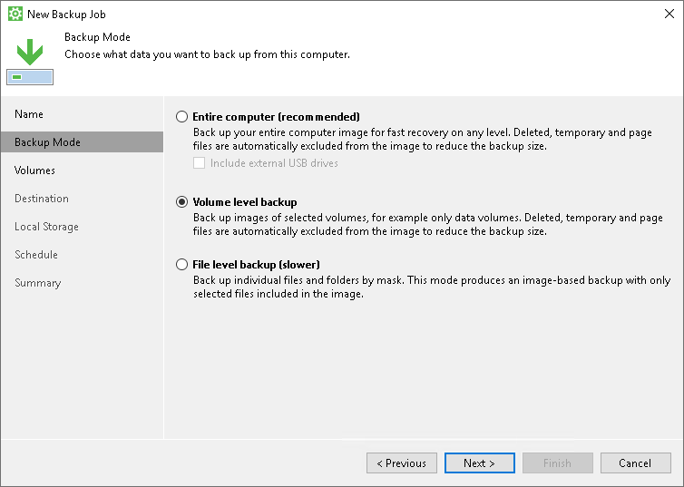

1. If you have selected to perform volume level or file level backup, select check boxes next to those objects that you want to include in the backup. Click Next.

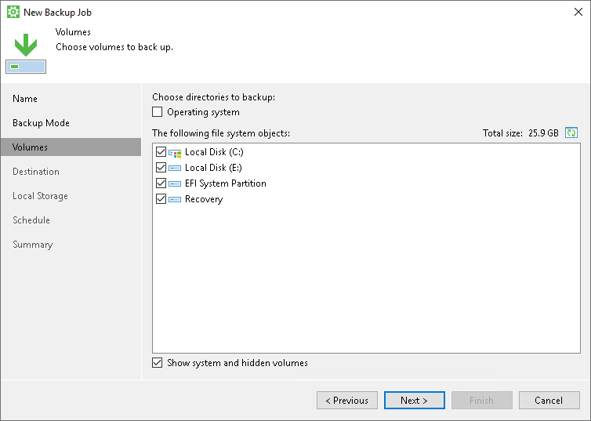

1. At the Destination step of the wizard, select Local storage. Click Next.

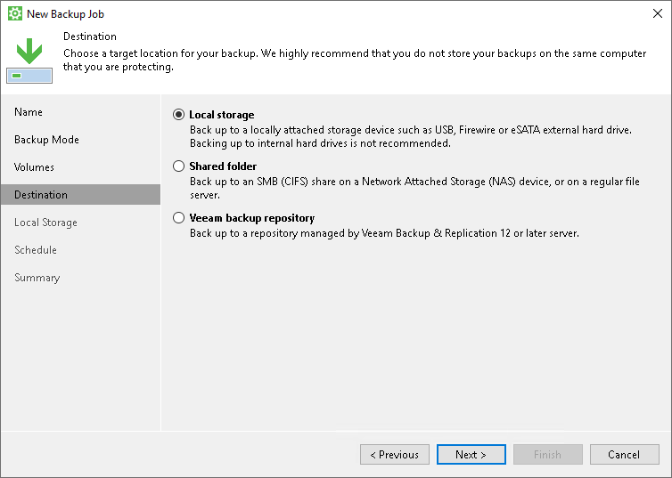

1. At the Local Storage step of the wizard, select a drive and specify a folder where you want to save backup files. Specify how many restore points you want to retain. Click Next.

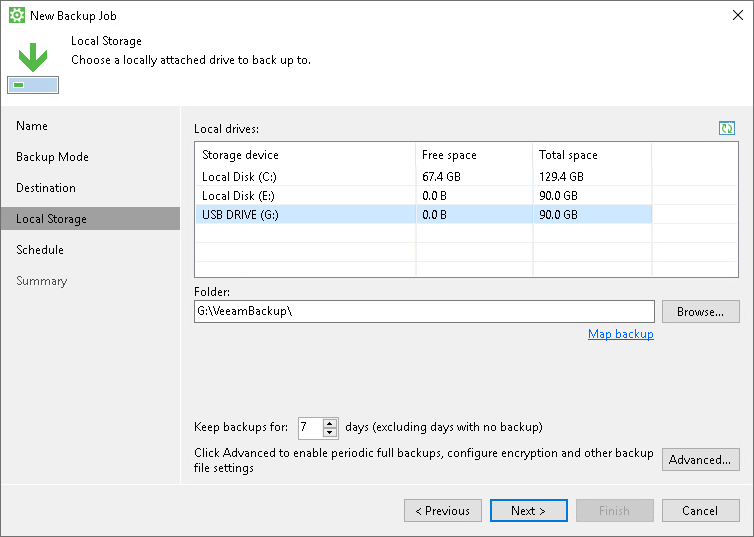

1. At the Schedule step of the wizard, specify the day and time when the backup job must be started and configure advanced scheduling settings if necessary.

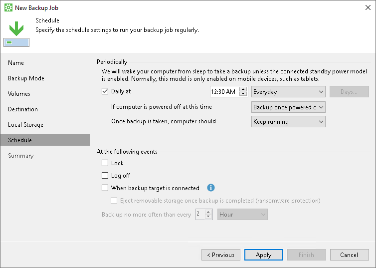

1. Click Apply, then click Finish.

