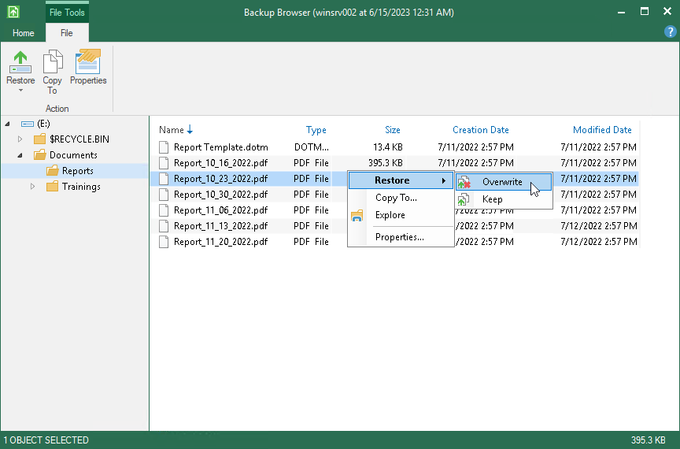

# How to Restore Files from Backup

If you accidentally delete some files or files get corrupted, you can restore these files from the backup. Files can be restored from the file-level and volume-level backups created by Veeam Agent for Microsoft Windows, to their original location or to a new location.

This scenario describes how to restore a file from the backup to its original location.

1. Double-click the Veeam Agent for Microsoft Windows icon in the system tray or right-click the icon and select Control Panel. In the main menu, hover over the name of the job that that created the backup from which you want to restore data, and select Restore file.
2. In the displayed window, select a restore point from which you want to restore the file and click Next.
3. Click Open. Veeam Agent will display the backup file content in the Veeam Backup browser.
4. Locate the file you want to restore, right-click it and select Restore > Overwrite. The file will be restored to its original location.

