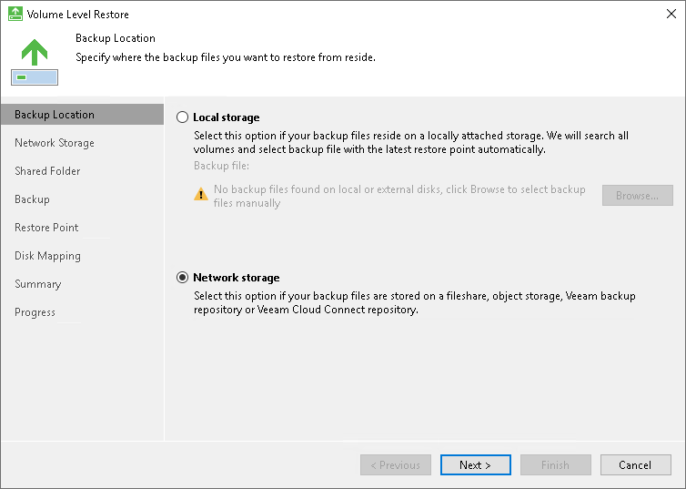
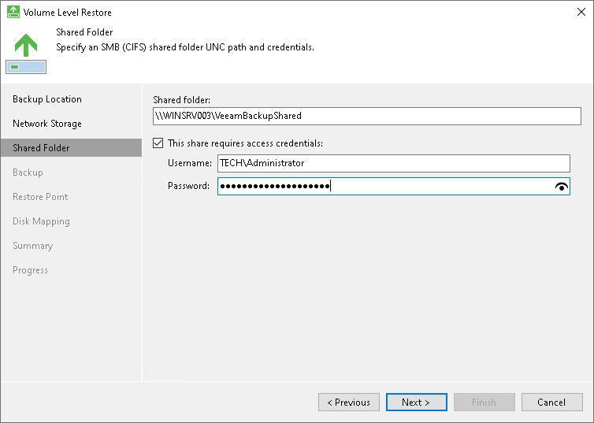
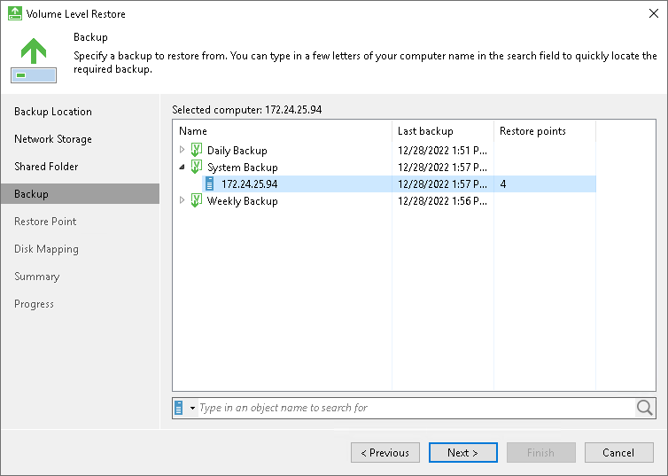
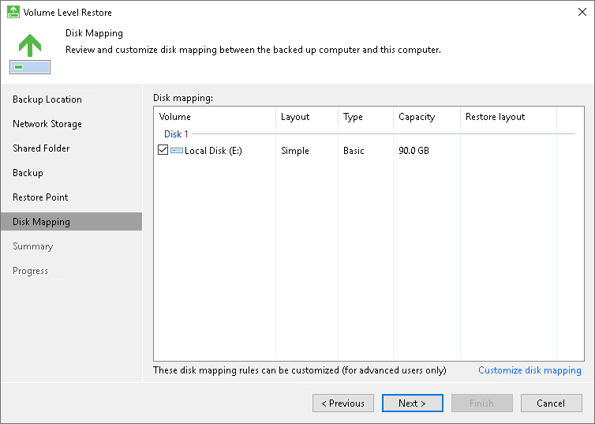

# How to Restore Computer Volume

If a computer volume gets corrupted, you can restore it from the backup. The volume can be restored to its original location or to a new location. Note that you can restore volumes only from volume-level backups. You cannot restore volumes from file-level backups.

This scenario describes how to restore a volume from the backup available on a shared network folder to its original location.

1. Right-click the Veeam Agent for Microsoft Windows icon in the system tray and select Restore > Entire volumes.

1. At the Backup Location step of the wizard, select Network storage. Click Next.

1. At the Network Storage step of the wizard, select Shared folder. Click Next.

1. At the Shared Folder step of the wizard, specify settings of the shared folder where the backup is located. Click Next.

1. At the Backup step of the wizard, select the necessary backup in the shared folder. Click Next.

1. At the Restore Point step of the wizard, select a restore point from which you want to restore data. Click Next.

1. Select the volume that you want to restore. Consider the following:

+ You cannot restore the system volume to its original location.
+ You cannot restore a volume to the volume on which the Microsoft Windows swap file is hosted.
+ You cannot restore a volume to the volume where the backup file that you use for restore is located.

To overcome these limitations, you can perform [bare metal recovery](howto_baremetal_recovery.md).

1. Click Next, then click Restore.
2. Once restore is completed, click Finish to close the wizard.

