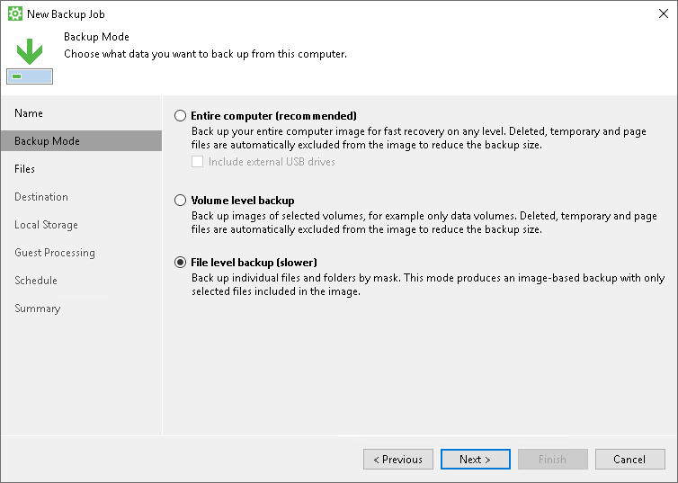
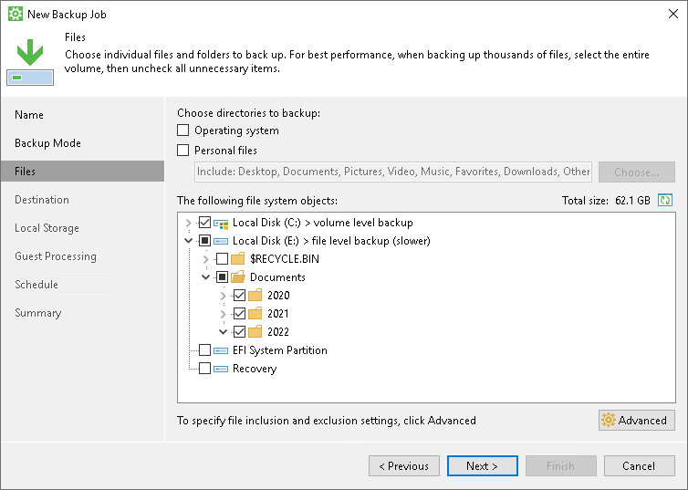
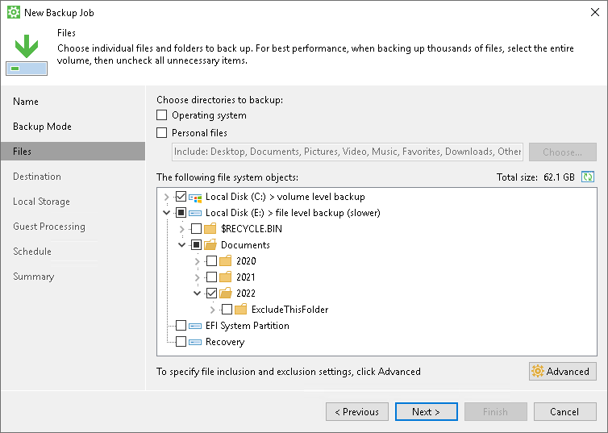
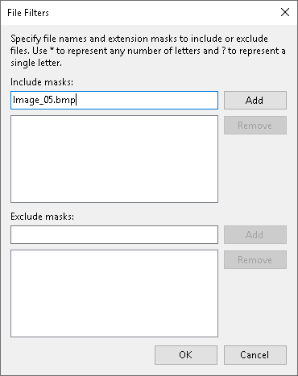
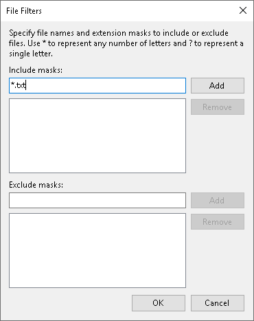
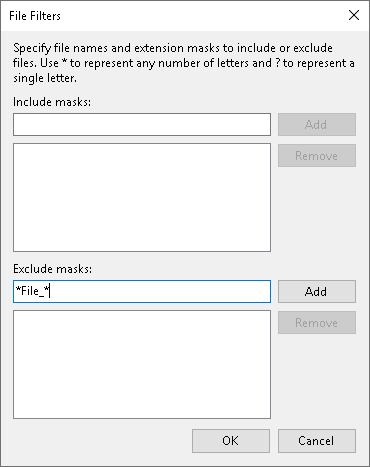

# How to Use Filters to Define File-Level Backup Scope

Veeam Agent for Microsoft Windows provides advanced filtering capabilities that allow you to select specific data for a file-level backup. You can include and exclude files and folders from the backup job scope by using include and exclude masks. This topic demonstrates several basic scenarios you may want to implement in your infrastructure.

Before You Begin

Before you configure filters for the backup, consider the following:

* This topic covers the file filtering functionality available in Veeam Agent for Microsoft Windows operating in the standalone mode.

Available file filter settings depend on the operation mode of Veeam Agent — standalone or managed. To learn more about setting up file filters for backup jobs when Veeam Agent operates in the managed mode, see the [Using Filters in Backup Jobs for Windows Computers](https://helpcenter.veeam.com/docs/vbr/userguide/appendix_d_windows_computer_backup_filters.html?ver=13) in the Veeam Backup & Replication User Guide.

* All backup scenarios in this topic are performed in the file-level backup mode.

A file-level backup job may contain entire volumes and individual folders from other volumes (this is referred to as hybrid backup job) — entire volumes are processed using volume-level backup mode while specific folders from other volumes are processed using file-level backup mode. In this case, file filters only work when the file-level backup mode is used. If you select an entire volume — for example, C:\, no filtering of files on that volume can occur.

* When you specify include masks, the backup will contain only the data that matches these masking criteria within the backup scope. When you specify exclude masks, the backup will contain all data from the backup scope except the data that matches these masking criteria.

Setting Up File Filters for Backup Scope

To specify file filters when you create a new job, do the following:

1. At the Backup Mode step of the Backup Job wizard, select the File level backup option.

1. At the Files step, select the folders you want to back up.

In this example, the following objects are selected:

* The entire volume C:\.
* Folders 2020, 2021 and 2022 in the Documents folder on the volume E:\.

1. Click Advanced; in the File Filters window, use include and exclude masks to select specific data for backup.

You can browse the disk content and manually include or exclude folders in/from the backup. You can use include and exclude masks for more granular definition of the backup job scope. To learn more, see the following common scenarios:

* [Including a Folder and Excluding a Subfolder](#IncExcl_01).
* [Including or Excluding Specific Files](#IncExcl_04).
* [Including or Excluding Files by File Type](#IncExcl_03).
* [Including or Excluding Files Whose Names Contain a Specific Sequence of Characters](#IncExcl_02).
* [Including or Excluding Files Named According to a Convention](#IncExcl_05).

Including a Folder and Excluding a Subfolder

At the Files step of the Backup Job wizard, when you select a folder to back up, its subfolders are selected too. You can exclude a subfolder of the selected folder from the backup. In this example, we will exclude the ExcludeThisFolder subfolder from the 2022 folder. To do this:

1. In the The following file system objects list, select the 2022 folder.
2. Expand the selected folder node and clear the check box next to the ExcludeThisFolder subfolder:

As a result, the backup will contain all data from the 2022 folder except the ExcludeThisFolder subfolder.

Including or Excluding Specific Files

You can select specific files for inclusion or exclusion. In this example, we will include only the Image\_05.bmp file into the backup. To do this:

1. In the Include masks field, enter Image\_05.bmp:

1. Click Add.
2. Click OK to complete the configuration.

As a result, the backup will contain only the Image\_05.bmp file from the specified backup scope.

Including or Excluding Files by File Type

You can include or exclude files by their type using a wildcard character instead of the file name — for example, \*.docx will select all Microsoft Word files with such extension in the backup scope.

In this example, we will back up only the text files in the .txt format. To do this:

1. In the Include masks field, enter \*.txt to select all files with the .txt extension.

1. Click Add.
2. Click OK to complete the configuration.

As a result, the backup will contain all text files in the .txt format from the backup scope.

|  |
| --- |
|  NOTE |
| You can combine include and exclude masks as needed. For example, you can include all .pdf files into the backup scope and exclude the ones that contain the word draft in their name by specifying \*.pdf in the include mask and \*draft\* in the exclude mask. |

Including or Excluding Files Whose Names Contain a Specific Sequence of Characters

You can include or exclude files whose names contain a specific sequence of characters. In this example, we will exclude files of any type that have File\_ in the name. To do this:

1. In the Exclude masks field, enter \*File\_\*.

This will select all files that contain this sequence of characters in any position in the file name.

1. Click Add.
2. Click OK to complete the configuration.

As a result, the backup will contain all data from the backup scope except the files that contain File\_ in the name — for example, File\_01.txt or Draft\_File\_05.pdf.

Including or Excluding Files Named According to a Convention

You may have a set of files named according to a convention — for example, File\_XX.txt where XX is a two-digit number. You can use a single-character wildcard to select a range of files for inclusion or exclusion. In this example, we will exclude files named according to the File\_XX.txt convention with numbers ranging from 01 to 09:

1. In the Exclude masks field, enter File\_0?.txt.

1. Click Add.
2. Click OK to complete the configuration.

As a result, the backup will contain all data from the backup scope except the text files whose names contain a digit ranging from 1 to 9 in the position of the wildcard character specified in the mask — for example, File\_01.txt, File\_07.txt and so on. Keep in mind that this filter will also exclude files whose names contain any other character in the wildcard position — for example, File\_0A.txt.

