# How to Back Up Microsoft SQL Server

To protect Microsoft SQL Server, you can use the Server edition of Veeam Agent for Microsoft Windows. You can set up the Veeam Agent backup job to create transactionally consistent backups of Microsoft SQL Server and periodically back up database transaction logs. If Microsoft SQL Server fails, you can restore the Microsoft SQL Server from the necessary restore point of the backup. If you use Veeam Agent for Microsoft Windows with Veeam Backup & Replication, you can also use Veeam Explorer for Microsoft SQL Server to apply transaction logs and get databases on the Microsoft SQL Server to the necessary state between backups.

This scenario describes how to set up the backup job to create transactionally consistent backups of Microsoft SQL Server. You will:

1. [Install a license for the Server edition of Veeam Agent for Microsoft Windows](#lic).
2. [Configure the backup job to create backups of the Microsoft SQL Server in the network shared folder](#backup).

To install a Veeam Agent for Microsoft Windows license:

1. Double-click the Veeam Agent for Microsoft Windows icon in the system tray, or right-click the Veeam Agent for Microsoft Windows icon in the system tray and select Control Panel.
2. From the main menu, select About.
3. In the Version section, click the Update license to get additional features link.

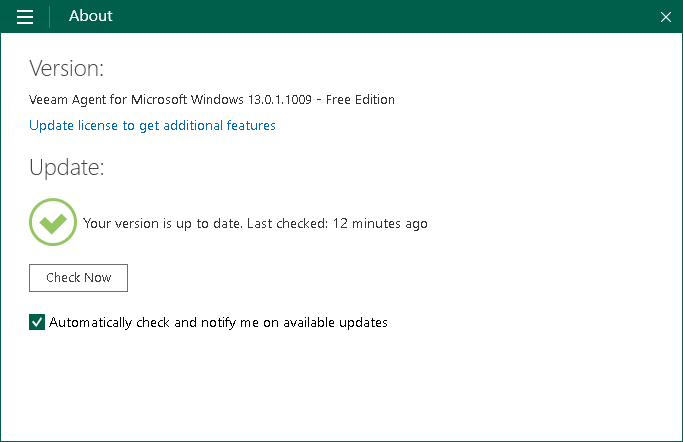

1. In the License section, click Install and browse for the LIC file that supports the Server edition of Veeam Agent for Microsoft Windows.

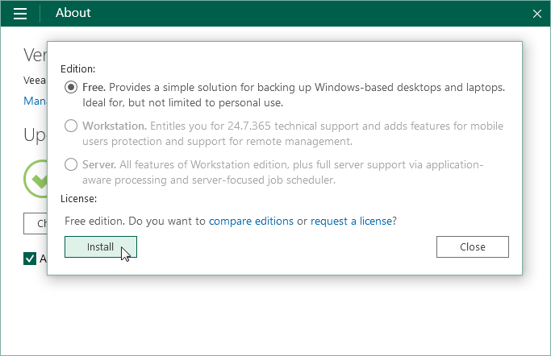

1. In the Edition section, make sure that the Server option is selected or select this option.

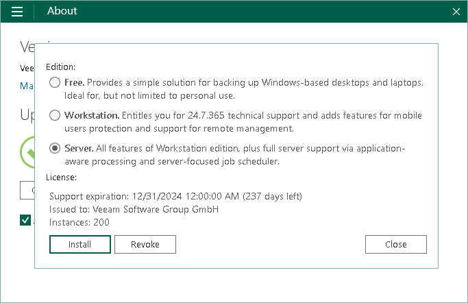Sus

1. Click Close.

To configure the backup job:

1. Double-click the Veeam Agent for Microsoft Windows icon in the system tray, or right-click the Veeam Agent for Microsoft Windows icon in the system tray and select Configure backup.

1. At the Name step of the wizard, specify the job name and description. Click Next.

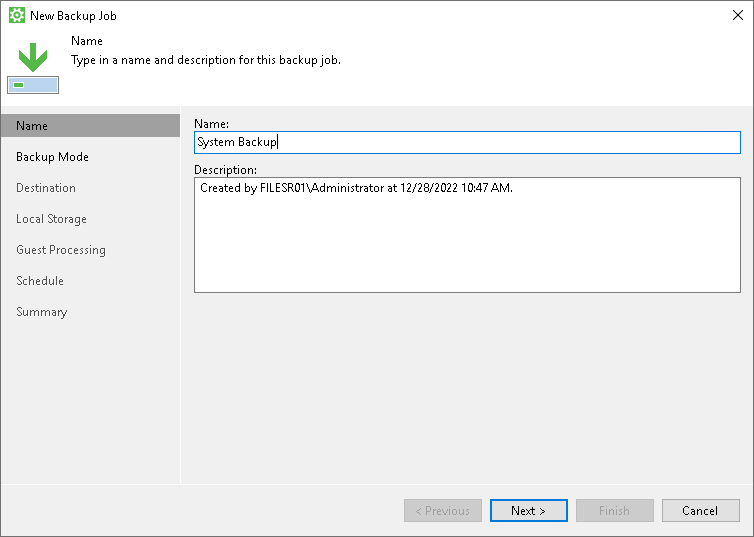

1. At the Backup Mode step of the wizard, select what data you want to back up: entire computer, specific computer volumes or individual folders with files. Click Next.

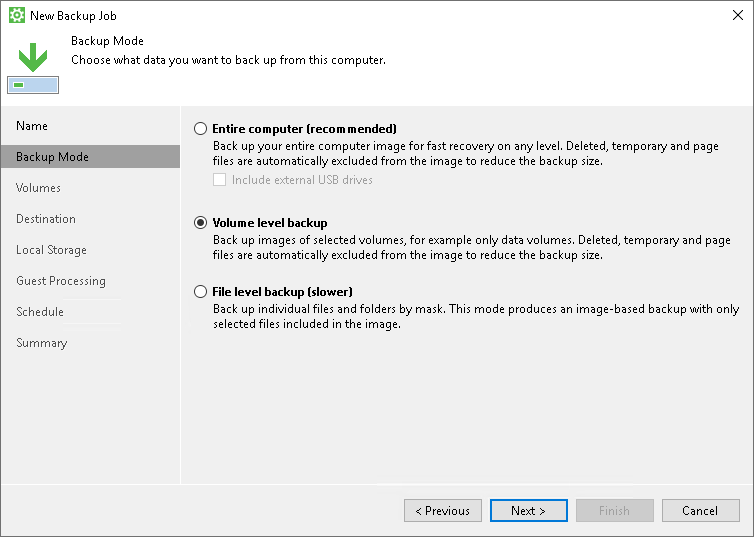

1. If you have selected to perform volume-level or file-level backup, select check boxes next to those objects that you want to include in the backup. Click Next.

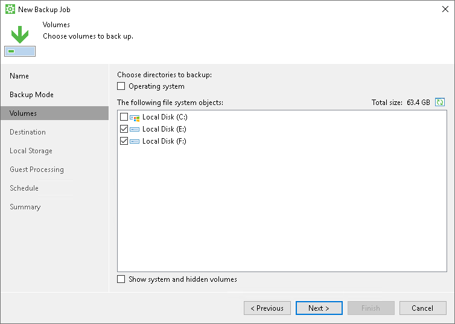

1. At the Destination step of the wizard, select Shared folder. Click Next.

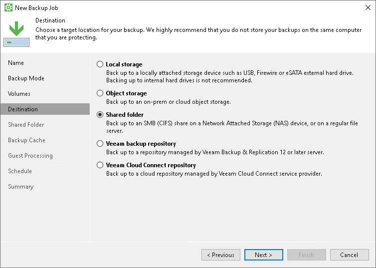

1. At the Shared Folder step of the wizard, specify settings to connect to the network shared folder in which you want to save backup files. Specify how many restore points you want to retain. Click Next.

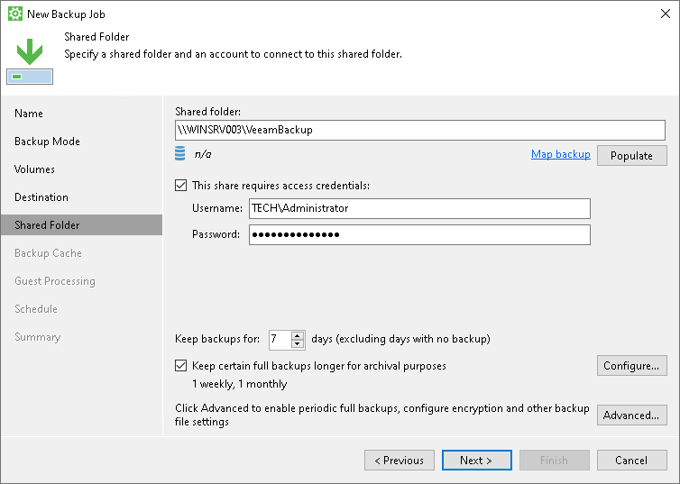

1. At the Backup Cache step of the wizard, click Next.
2. At the Guest Processing step of the wizard, make sure that the Enable application-aware processing check box is selected. Click Applications.

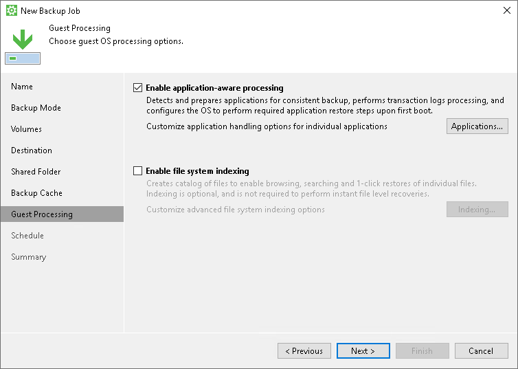

1. In the Processing Settings window, click the SQL tab. Specify settings for database transaction log processing. Click OK, then click Next.

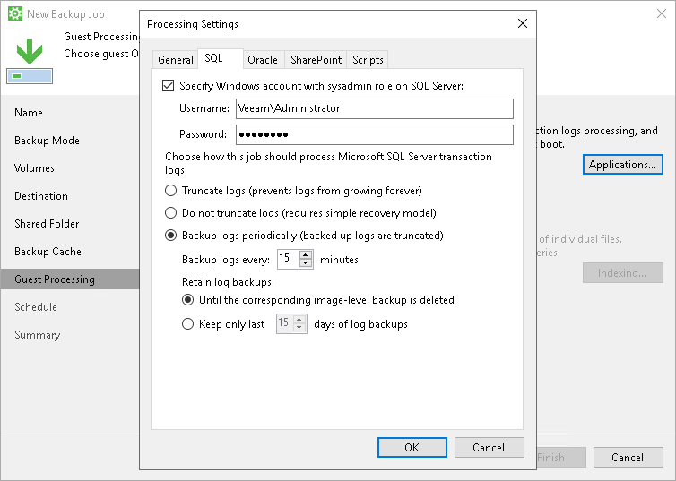

1. At the Schedule step of the wizard, specify the day and time when the backup job must be started and configure advanced scheduling settings if necessary.

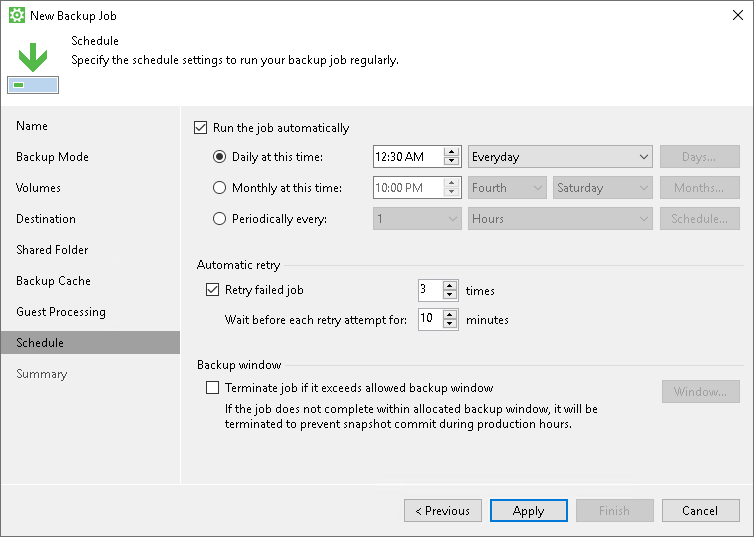

1. Click Apply, then click Finish.

