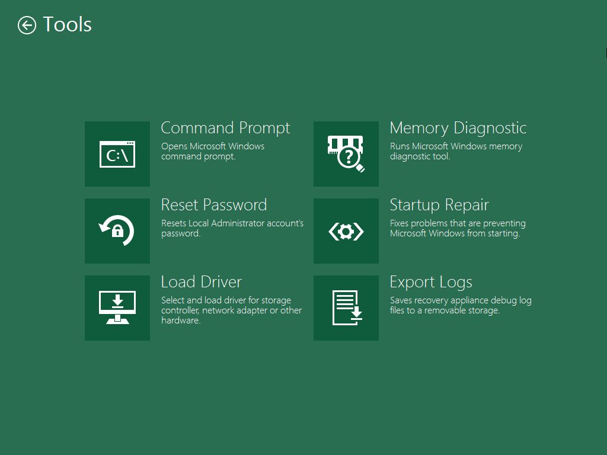

# Using Veeam Agent and Microsoft Windows Tools

When you boot from the Veeam Recovery Media, you can use a set of tools to repair typical causes of unbootable OS, diagnose your computer and perform advanced administration tasks. Veeam Agent for Microsoft Windows offers its native tools and standard Microsoft Windows recovery tools.

|  |
| --- |
|  IMPORTANT |
| Veeam Agent for Microsoft Windows includes Microsoft Windows Tools in the Veeam Recovery Media. If some of Microsoft Windows Tools components are missing on the computer, some of Microsoft Windows Tools may not be available when you boot from the Veeam Recovery Media. |

To open the tools view, on the Veeam Recovery Media screen, click Tools. Then choose the necessary tool from the list:

* Command Prompt — use this option to start the Microsoft Windows command prompt (cmd.exe).
* Reset Password — use this option to reset a password for the built-in Administrator account to none. The next time you boot your computer from the hard disk under the Administrator account, you will not have to specify any password. Consider the following:

* The password reset option does not function on domain controller machines.
* If the built-in Administrator account is disabled, this account will be enabled by the password reset option.

* Load Driver — use this option to load from external sources drivers that are not available on the Veeam Recovery Media. Drivers can be loaded from the computer drive or from a network shared folder.
* Memory Diagnostic (Microsoft utility) — use this option to check the system memory of your computer and detect potential problems. The utility can be started during the current work session or when you boot your computer the next time. To learn more, see [Microsoft documentation](http://technet.microsoft.com/en-us/magazine/2008.09.utilityspotlight.aspx).
* Startup Repair (Microsoft utility) — use this option to fix system problems that may prevent Microsoft Windows from starting, for example, missing and damaged system files or the corrupted boot sector. To learn more, see [this Microsoft KB article](http://windows.microsoft.com/en-us/windows/startup-repair-faq#1TC=windows-7).
* Export Logs — use this option to export the Veeam Agent for Microsoft Windows debug logs to a ZIP file and save this file on a removable storage appliance attached to your computer.

|  |
| --- |
|  NOTE |
| Do not save the archive file with debug logs on the local disk X: of the recovery image OS. This local disk is a temporary storage that will be automatically deleted after you finish working with the Veeam Recovery Media. |

