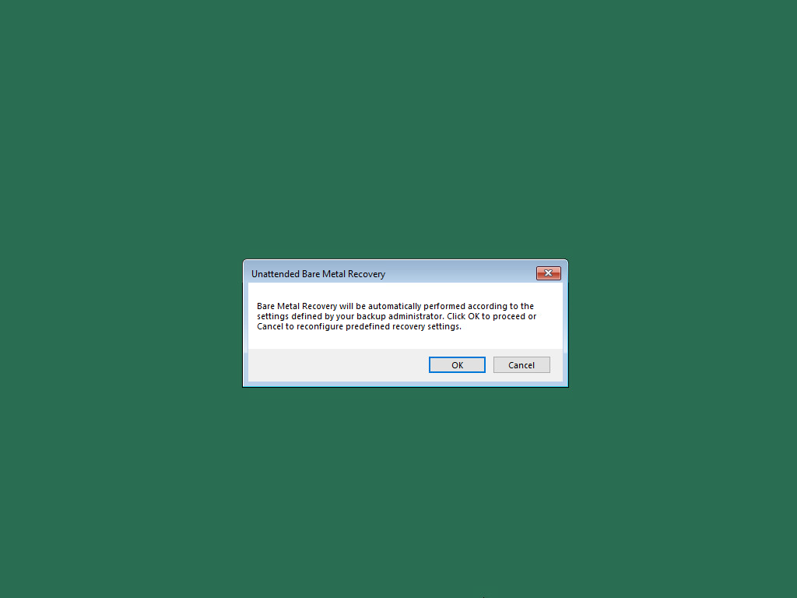

# Restoring from Veeam Recovery Media in the Unattended Mode

To perform restore from the Veeam Recovery Media in the unattended mode, you must use the Veeam Recovery Media with the [predefined restore settings](image_mode.md). Take the steps below to recover your computer:

1. Depending on the type of the media storing the recovery image, do the following:

* [For CD/DVD/BD] Power on your computer. Insert the media with the recovery image to the drive and power off the computer.
* [For removable storage device] Attach the removable storage device with the recovery image to your computer.

1. Start your computer.
2. If you did not disable the prompt when [creating the Veeam Recovery Media](image_create.md), you will be offered to boot the OS from the CD/DVD/BD or attached removable storage. Press any key on the keyboard to continue.

If the prompt was disabled, the boot will start automatically.

1. Wait for Veeam Agent for Microsoft Windows to load files from the Veeam Recovery Media. Loading the OS from the Veeam Recovery Media usually takes more time than loading the OS from the local computer drive.
2. After the OS has loaded, make sure that network settings are specified correctly and configure network if necessary. To learn more, see [Select Network Adapter or Wireless Network](baremetal_network.md).
3. Click Bare Metal Recovery.
4. In the Unattended Bare Metal Recovery window, click OK. If you click Cancel, the restore will start in the [manual mode](image_boot_manual.md).
5. If prompted, check the Veeam backup server certificate validation warnings. Click Continue to validate the certificate and go to the next step or click Cancel to stop the restore process.
6. If prompted, specify a recovery token to connect to the Veeam backup server in the Recovery token window.
7. If prompted, select a restore point from which you want to recover data in the Restore point window. Veeam Agent for Microsoft Windows will perform partition re-allocation operations if necessary, restore the data from the backup and overwrite data on your computer with the restored data.

|  |
| --- |
| TIP |
| If the restore process fails for any reason, you will be offered to start the restore in the [manual mode](image_boot_manual.md). |

