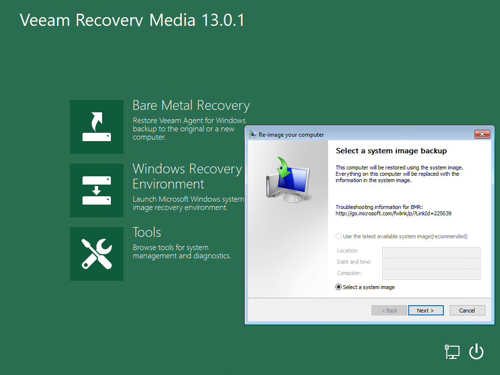

# Using Microsoft Windows Recovery Environment

If you have a Microsoft system image on the computer drive or a DVD archive with Microsoft system images, you can recover your computer using the Microsoft Windows System Image Recovery tool.

To access the Microsoft Windows System Image Recovery tool, on the Veeam Recovery Media screen, click Windows Recovery Environment.

The process of recovery does not differ from the process performed in Microsoft Windows. To learn more, see [this Microsoft KB article](http://windows.microsoft.com/en-us/windows/restore-computer-from-system-image-backup).

