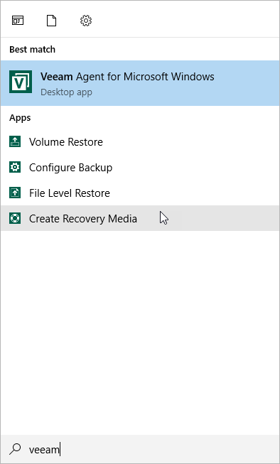

# Step 1. Launch Create Recovery Media Wizard

You can launch the Create Recovery Media wizard right after the product installation process or at any time later.

To launch the Create Recovery Media wizard after installation:

1. At the last step of the installation wizard, select the Run Veeam Recovery Media creation wizard check box.
2. Click Finish. Veeam Agent for Microsoft Windows will automatically launch the Create Recovery Media wizard.

To launch the Create Recovery Media wizard at any time, from the Microsoft Windows Start menu, select All Programs > Veeam > Tools > Create Recovery Media or use the Microsoft Windows search to find the Create Recovery Media option on your computer.

