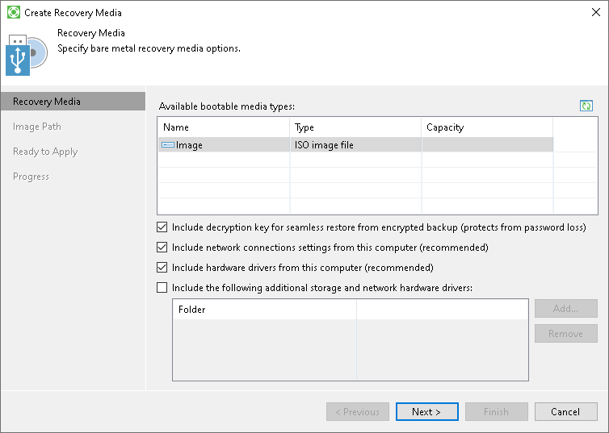

# Step 2. Specify Recovery Media Options

At the Recovery Media step of the wizard, specify on which type of media you want to create a recovery image and what drivers you want to include in the recovery image.

1. In the Available bootable media types list, select a media for the recovery image. You can create the following types of recovery images:

* Recovery image on a removable storage device. You can create a recovery image on a USB drive, SD card and so on. Veeam Agent for Microsoft Windows displays all removable storage devices currently attached to your computer. Select the necessary one in the list.
* ISO file with the recovery image. You can create a recovery image in the ISO file format and save the resulting file locally on your computer or in a network shared folder.

1. If you have enabled data encryption options for the backup job and want to include the decryption key in the recovery image, select the Include decryption key for seamless restore from encrypted backup check box. In this case, when you use the created recovery image to perform bare metal recovery, you will not have to enter the password used for encryption.
2. If you want to include in the recovery image current network settings, make sure that the Include network connections settings from this computer check box is selected. When you use the created Veeam Recovery Media to boot your computer, these settings will be automatically applied and will be used to connect to the remote backup storage.
3. If you want to include in the recovery image storage and network drivers that are currently installed on your computer, make sure that the Include hardware drivers from this computer check box is selected. Veeam Agent for Microsoft Windows will detect hard disk controller drivers, network adapter drivers and USB controller drivers and include them into the recovery image. When you use the created Veeam Recovery Media to boot your computer, these drivers will be automatically injected into Windows RE.
4. If you want to include in the recovery image additional storage and network drivers that you may need when booting from the recovery image, select the Include the following additional storage and network hardware drivers check box, click Add and select a folder containing necessary drivers. The folder that you select must contain all files of the driver package (files in CAT, INF and SYS formats).

We strongly recommend that you enable this option if you use drivers that are not included into the Microsoft Windows installation DVD. For example, you can include drivers for a discrete network card, third party USB 3.0 controllers and non-standard hard disk controllers.

|  |
| --- |
|  IMPORTANT |
| Consider the following:   * When you boot your computer from the Veeam Recovery Media, Veeam Agent for Microsoft Windows does not automatically install additional drivers included in the recovery image. You need to install such drivers manually using the Load Driver tool. To learn more, see [Using Veeam Agent and Microsoft Windows Tools](image_boot_endpoint.md). * We do not recommend to include large amount of additional drivers (1 GB and more) in the Veeam Recovery Media. When you boot your computer from the Veeam Recovery Media, Veeam Agent for Microsoft Windows loads all additional drivers stored in the Veeam Recovery Media into your computer RAM. If the total size of the recovery environment is approximately equal to or greater than the amount of RAM, Windows RE will fail to load. |

