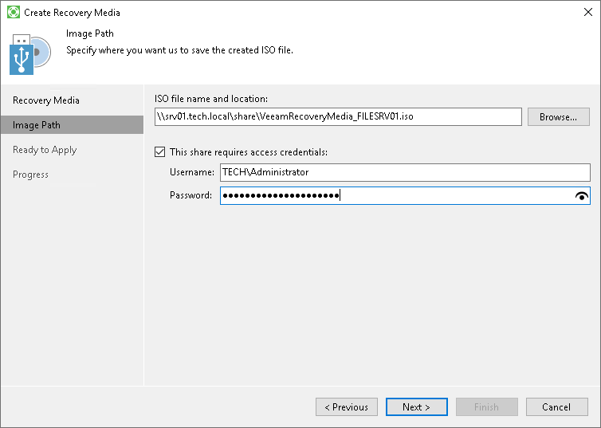

# Step 3. Specify Path to ISO

The Image Path step of the wizard is available if you have selected to create an ISO file with the recovery image.

Select a location where you want to save the ISO file.

1. In the ISO file name and location field, specify a real path to the folder where you want to save the created recovery image and the ISO file name. You can save the ISO file in the following locations:

+ Local folder: select the necessary folder on your computer.
+ Network shared folder: specify a UNC path to a network shared folder. Keep in mind that a UNC path always starts with two back slashes (\\).

We strongly recommend that you store the recovery image in a location other than a local computer drive. If you choose to save the recovery image in a local folder on your computer, you can copy it to an external location afterwards. In this case, the recovery image will always be available should computer volumes get corrupted or the computer fail to start.

1. If you chose to save the ISO file in a network shared folder and this folder requires authentication, select the This share requires access credentials check box and enter the user name and password in the Username and Password fields. The user name must be specified in the DOMAIN\UserName format.

To view the entered password, click and hold the eye icon on the right of the Password field.

