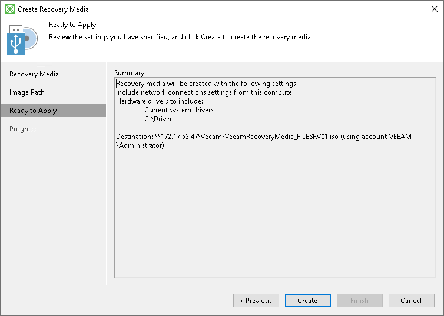
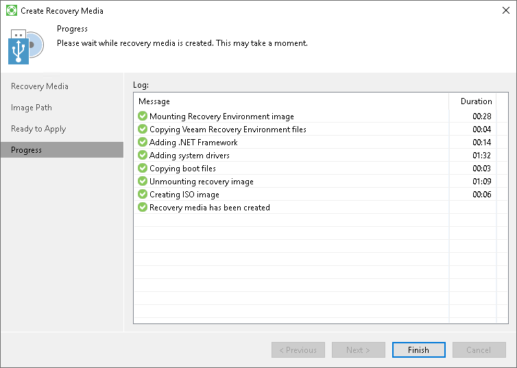

# Step 4. Review Recovery Image Settings

At the Ready to Apply step of the wizard, review settings of the recovery image that you plan to create and click Create.

Veeam Agent for Microsoft Windows will collect files necessary for recovery image creation and write the resulting recovery image to the specified target.

The process of recovery image creation may take some time. Wait for the process to complete and click Finish to exit the wizard.

If you want to interrupt the process of recovery image creation, click Cancel or close the wizard window.

