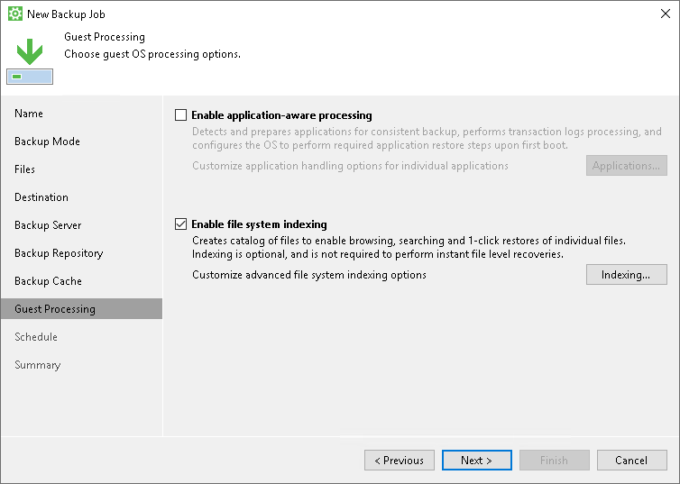

# File System Indexing

You can instruct Veeam Agent for Microsoft Windows to create an index of files and folders on the Veeam Agent computer OS during backup. If you use Veeam Agent for Microsoft Windows with Veeam Backup & Replication, you will be able to search for individual files inside Veeam Agent backups and perform 1-click restore in Veeam Backup Enterprise Manager.

|  |
| --- |
| NOTE |
| File system indexing is optional. If you do not enable this option in the backup job settings, you will still be able to perform 1-click restore from the backup created with such backup job. For more information, see the [Preparing for File Browsing and Searching](https://helpcenter.veeam.com/docs/vbr/em/preparing_for_file_browsing.html?ver=13) section in the Veeam Backup Enterprise Manager User Guide. |

Related Tasks

[Creating Backup Jobs](backup_job_create.md)

