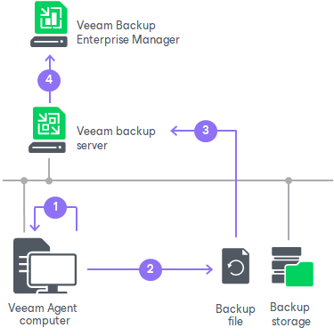

# How File Indexing Works

When you run a backup job with the file indexing option enabled, Veeam Agent for Microsoft Windows performs the following operations:

1. When the backup job starts, Veeam Agent for Microsoft Windows starts indexing the file system. The indexing procedure is carried out in parallel with the backup procedure. If indexing takes long, Veeam Agent for Microsoft Windows will not wait for the indexing procedure to complete. It will start copying data to the target location and continue file indexing.
2. When file indexing is complete, Veeam Agent for Microsoft Windows collects indexing data, writes it to an archive file and stores this archive file to the backup file along with the backed-up data.
3. If the backup job is set up to create backups in a Veeam backup repository, when the job completes, Veeam Guest Catalog Service running on the backup server also saves indexing data in the Veeam Catalog folder on the backup server.

To learn more about the Veeam Guest Catalog Service, see the [Veeam Backup Catalog](https://helpcenter.veeam.com/docs/vbr/userguide/indexing_catalog.html?ver=13) section in the Veeam Backup & Replication User Guide.

1. During the next catalog replication session, the global Veeam Guest Catalog Service replicates data from the backup server to the Veeam Catalog folder on the Veeam Backup Enterprise Manager server.

|  |
| --- |
| NOTE |
| Consider the following:   * If the backup job is set up to create backups in a Veeam Cloud Connect repository, Veeam Backup & Replication running on the SP backup server does not save indexing data in the Veeam Catalog folder. * Due to the peculiarities of file indexing algorithms, file indexing takes more time if you backup volumes with a file system different from NTFS or volumes with data deduplication enabled. |

