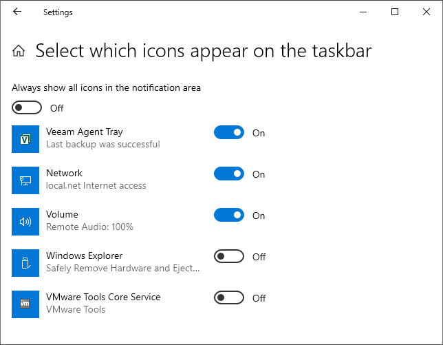

# What You Do Next

After the product installation, Veeam Agent for Microsoft Windows displays its icon in the system tray. You can use the system tray icon to perform main operations in Veeam Agent for Microsoft Windows:

* Configure the backup job and start ad-hoc backup operations
* Launch restore wizards
* Open the Veeam Agent control panel
* Monitor the state of backup tasks and so on

Depending on the current settings of your Microsoft Windows OS, the Veeam Agent for Microsoft Windows icon may not be displayed in the system tray.

To bring the icon to the system tray:

1. In Microsoft Windows, open the Notification Area Settings window. To do this, do either of the following:

+ Click the arrow in the system tray and click Taskbar Settings.
+ From the Microsoft Windows main menu, select Control Panel and navigate to Taskbar and Navigation. In the Taskbar section, select Notification Area.

1. In the Notification Area Settings window, select On for the Veeam Agent Tray.
2. In the Behaviors column, set the Show icon and notification setting for it.

