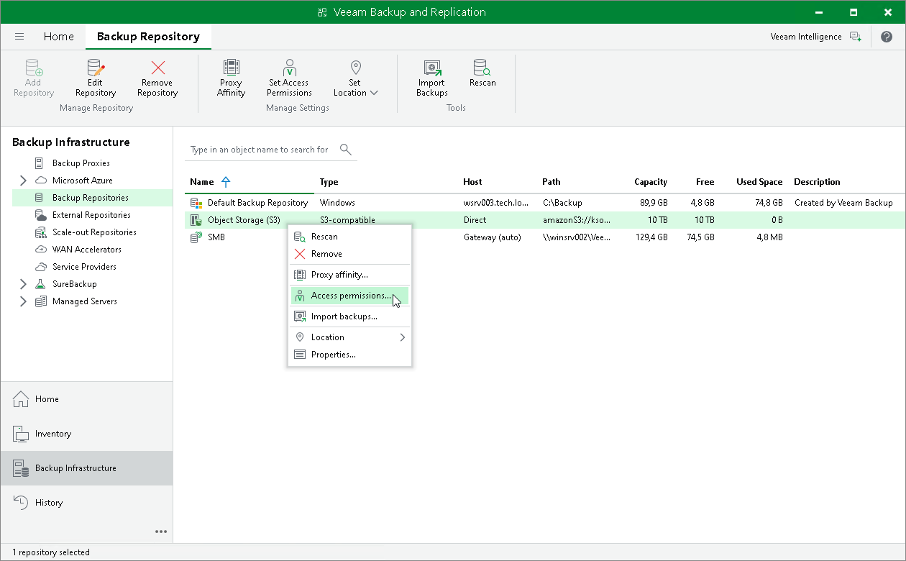
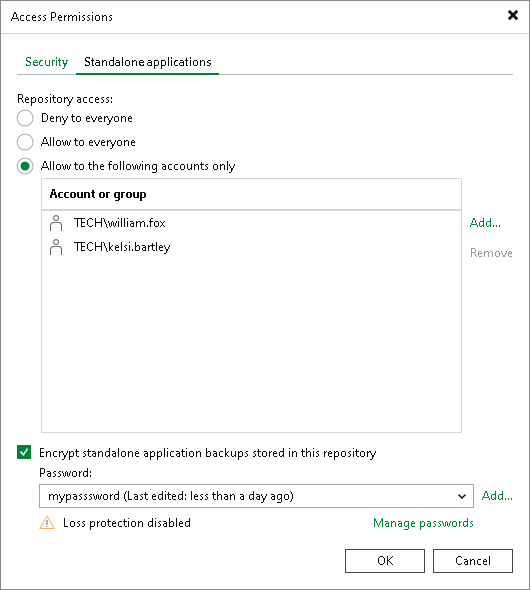

# Setting Up User Permissions on Backup Repositories

To be able to store backups in a backup repository managed by a Veeam backup server, the user must have access permissions on this backup repository.

|  |
| --- |
| IMPORTANT |
| Veeam Agent for Microsoft Windows does not support Veeam backup repositories with enabled KMS encryption. To learn more about KMS encryption for Veeam backup repositories, see the [Key Management System Keys](https://helpcenter.veeam.com/docs/vbr/userguide/kms.html?ver=13) section in the Veeam Backup & Replication User Guide. |

|  |
| --- |
| NOTE |
| If you plan to create backups in a Veeam backup repository with Veeam Agent backup jobs configured in Veeam Backup & Replication, you do not need to grant access permissions on the backup repository to users. In the Veeam Agent management scenario, to establish a connection between the backup server and protected computers, Veeam Backup & Replication uses a TLS certificate. To learn more, see the [Configuring Security Settings](https://helpcenter.veeam.com/docs/vbr/userguide/agents_manage_tls_and_ssh.html?ver=13) section in the Veeam Backup & Replication User Guide. |

Access permissions are granted to security principals such as users and AD groups by the backup administrator working with Veeam Backup & Replication. Users with granted access permissions can target Veeam Agent backup jobs at this backup repository and perform restore from backups located in this backup repository.

Right after installation, access permissions on the default backup repository are set to Allow to everyone for testing and evaluation purposes. If necessary, you can change these settings.

After you create a new backup repository, access permissions on this repository are set to Deny to everyone. To allow users to store backups in the backup repository, you must grant users with access permissions to this repository.

To grant access permissions to a security principal:

1. In Veeam Backup & Replication, open the Backup Infrastructure view.
2. In the inventory pane, click one of the following nodes:

* The Backup Repositories node — if you want to grant access permissions on a regular backup repository to Veeam Agent users.
* The Scale-out Repositories node — if you want to grant access permissions on a scale-out backup repository to Veeam Agent users.

1. In the working area, select the necessary backup repository and click Set Access Permissions on the ribbon, or right-click the backup repository and select Access permissions. If you do not see the Set Access Permissions button on the ribbon or the Access permissions command is not available in the shortcut menu, press and hold the [Ctrl] key, right-click the backup repository and select Access permissions.

1. In the Access Permissions window, in the Standalone applications tab, specify to whom you want to grant access permissions on this backup repository:

* Allow to everyone — select this option if you want all users to be able to store backups on this backup repository. Setting access permissions to Everyone is equal to granting access rights to the Everyone Microsoft Windows group (Anonymous users are excluded). However, we recommend this scenario for demo environments only.
* Allow to the following accounts or groups only — select this option if you want only specific users to be able to store backups on this backup repository. Click Add to add the necessary users and groups to the list.

|  |
| --- |
| TIP |
| If you want to back up data to Veeam Backup & Replication on Linux with a local Veeam appliance user, specify a user with the Service Account role. This role allows access to the Veeam backup repository and does not require the password rotation.  To learn more about available local user roles, see the [Managing Users and Roles](https://helpcenter.veeam.com/docs/vbr/userguide/hmc_users.html?ver=13) section in the Veeam Backup & Replication User Guide. |

1. If you want to encrypt Veeam Agent backup files stored in the backup repository, select the Encrypt backups stored in this repository check box and choose the necessary password from the field below. If you have not specified a password beforehand, click Add on the right or the Manage passwords link to add a new password. Veeam Backup & Replication will encrypt files at the backup repository side using its built-in encryption mechanism. To learn more, see the [Encrypting Standalone Application Backups in Backup Repositories](https://helpcenter.veeam.com/docs/vbr/userguide/encrypting_backups.html?ver=13) section in the Veeam Backup & Replication User Guide.

|  |
| --- |
| IMPORTANT |
| If Veeam Agent is set up to use the backup cache, and the backup cache contains one or more restore points, Veeam Agent will automatically remove these restore points from the backup cache after you enable or disable the encryption option for the backup repository. |

