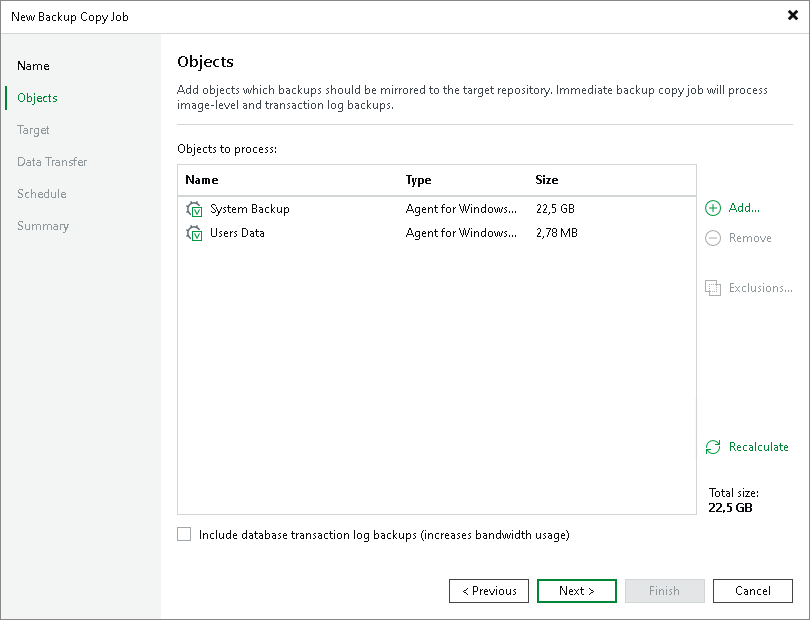
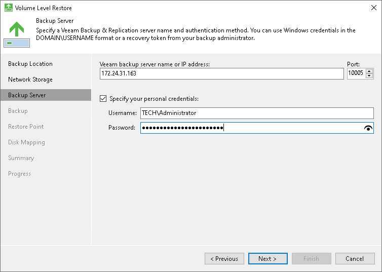

# Performing Backup Copy for Veeam Agent Backups

You can configure backup copy jobs that will copy backups created with Veeam Agent to a secondary backup repository.

Backup copy jobs treat Veeam Agent backups as usual backup files. The backup copy job setup and processing procedures practically do not differ from the same procedures for a backup copy job that processes VM backups. To learn more about backup copy jobs, see the [Backup Copy](https://helpcenter.veeam.com/docs/vbr/userguide/backup_copy.html?ver=13) section in the Veeam Backup & Replication User Guide.

Considerations and Limitations for Copying Failover Cluster Backups

When you copy failover cluster backups, consider the following:

* The backup copy job creates a single backup copy file for each failover cluster.
* When you copy Veeam Agent backup jobs that process failover clusters with shared disks, the network traffic is higher compared to the traffic sent when Veeam Agent backup jobs run. This happens because Veeam Agent backup copy jobs send data as it is stored in the storage — each node with the cloned data — unlike Veeam Agent backup jobs that send data of shared disks only with the owner node and then, within the target storage, clone this data to other nodes.

* Data deduplication is not available when you copy Veeam Agent backup jobs that process failover clusters with shared disks to an object storage repository.

|  |
| --- |
| IMPORTANT |
| In this case, you may require additional free space on the target location, because Veeam Backup & Replication creates in the target location as many copies of the cluster shared disks as there are nodes in the cluster. |

Restoring Data from Copies of Veeam Agent Backups

Backups copied to the secondary backup repository do not preserve user access permissions. At the same time, users who created backups do not have access permissions on these secondary repositories. For this reason, users cannot restore data from their backups residing in the secondary site.

To overcome this limitation, you can delegate the restore task to backup administrators who work with Veeam Backup & Replication. Backup administrators can use Veeam Backup & Replication options to recover data from such backups: for example, perform file-level restore or retrieve necessary application items with Veeam Explorers.

You can also restore data from the copied backup stored in the target repository using Veeam Agent.

To do this:

1. In Veeam Agent, launch the Volume Level Restore wizard to restore volumes or File Level Restore wizard to restore files and folders. You can also boot from the Veeam Recovery Media and launch the Veeam Recovery Media wizard for data restore.
2. At the Backup Location step of the wizard, select Network storage.
3. At the Network Storage step of the wizard, select to restore data from the backup repository.
4. At the Backup Server wizard, specify settings for the Veeam backup server that manages the target backup repository where the copied backup is located.
5. Select the Specify your personal credentials check box and provide credentials for the user who has the Veeam Backup Administrator or Veeam Restore Operator role on the Veeam backup server.
6. Pass through the next steps of the wizard and select a backup and restore point from which you want to restore data.

