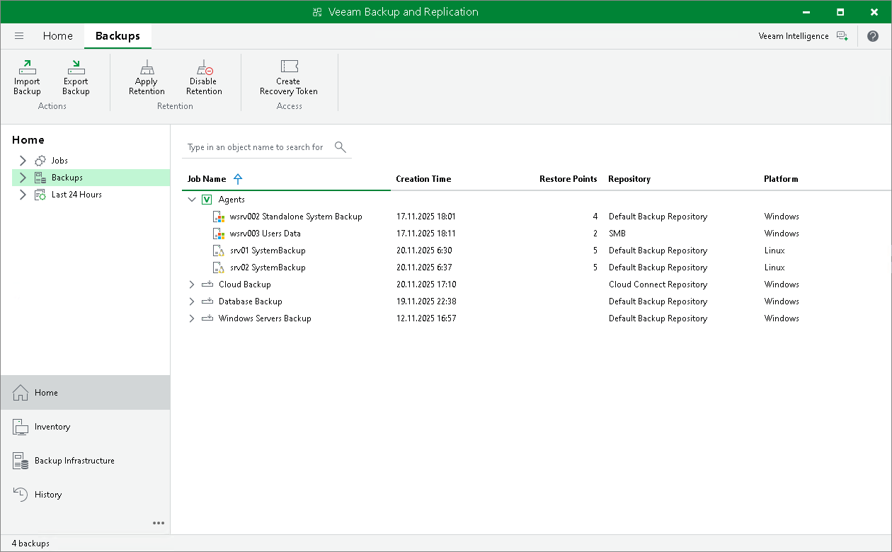

# Backing Up to Backup Repositories

You can store backups created with Veeam Agent in backup repositories connected to Veeam backup servers. To do this, you must perform the following actions:

1. [Set up user permissions at the backup repository side](integrate_permissions.md).
2. [Point the Veeam Agent backup job to the backup repository](backup_job_vbr.md).

|  |
| --- |
| NOTE |
| Consider the following:   * A Veeam Agent backup job can be started automatically upon the defined schedule or manually from the Veeam Agent computer. You cannot start, stop, retry or edit Veeam Agent backup jobs in the Veeam Backup & Replication console. * If the user is granted restore permissions on the Veeam backup server, the user will be able to see all backups in the backup repository.  * The user who creates a Veeam Agent backup in the backup repository is set as the owner of the backup file. The backup file owner can access this file and restore data from it. If the user who is not the backup file owner needs to perform operations with the backup file, the user must have the Veeam Backup & Replication role that allows to perform these operations. To learn more about roles, see the [Users and Roles](https://helpcenter.veeam.com/docs/vbr/userguide/users_roles.html?ver=13) section in the Veeam Backup & Replication User Guide. |

Backup jobs targeted at the backup repository become visible in Veeam Backup & Replication under the Jobs > Backup node in the Home view. Backups created with Veeam Agent are available under the Backups > Disk node in the Home view.

The Veeam Backup Administrator working with Veeam Backup & Replication can manage Veeam Agent backup jobs and restore data from Veeam Agent backups. To learn more, see [Restoring Data from Veeam Agent Backups](performing_restore_tasks.md) and [Performing Administration Tasks](integration_administration.md).

