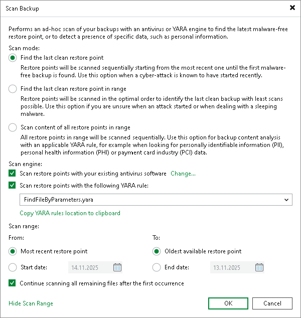

# Scanning Backup

If you want to scan restore points of a backup after a malware attack or to look for some sensitive data in a backup, you can run the scan backup session:

1. Open the Home view.
2. In the inventory pane, click Backups.
3. In the working area, expand the Veeam Agent backup, select the necessary computer in the backup and click Scan Backup on the ribbon or right-click the computer and select Scan Backup.
4. Specify the scan mode you want to use:

* Find the last clean restore point
* Find the last clean restore point in range
* Scan content of all restore points in range

1. If you want to use antivirus software as a scan engine, select the Scan the restore points with your existing antivirus software check box. Click Change to review or update the antivirus settings. To learn more, see the [Configuring Malware Detection](https://helpcenter.veeam.com/docs/vbr/userguide/malware_detection_configuring.html?ver=13) section in the Veeam Backup & Replication User Guide.
2. If you want to use a YARA rule as a scan engine, select the Scan restore points with the following YARA rule check box and specify the YARA file located in the Veeam Backup & Replication product folder: C:\Program Files\Veeam\Backup and Replication\Backup\YaraRules.

If you do not want to create a malware detection event for a YARA rule, you can add a SuppressMalwareDetectionNotification tag to the name of the rule. For example:

|  |
| --- |
| rule SearchFileHash : SuppressMalwareDetectionNotification |

In this case, the malware detection event will not be created but the scan backup session will be finished with the Warning status.

1. Configure the scan range. You can specify the following options:

* Scan all restore points, from most recent restore point to the oldest available restore point.
* Scan restore points created during a specific time period.

Veeam Backup & Replication selects the order in which to scan restore points depending on the selected scan mode:

* In the Find the last clean restore point mode, Veeam Backup & Replication scans restore points from the most recent to the oldest.
* In the Find the last clean restore point in range mode, Veeam Backup & Replication scans restore points in the optimal order.
* In the Scan content of all restore points in range mode, Veeam Backup & Replication scans restore points from the oldest to the most recent.

If you want to continue the scan backup session after the first malware or the first piece of specific information is found, select the Continue scanning all remaining files after the first occurence check box.

1. Click OK.

To learn more, see the [Scan Backup](https://helpcenter.veeam.com/docs/vbr/userguide/malware_detection_scan_backup.html?ver=13) section in the Veeam Backup & Replication User Guide.

