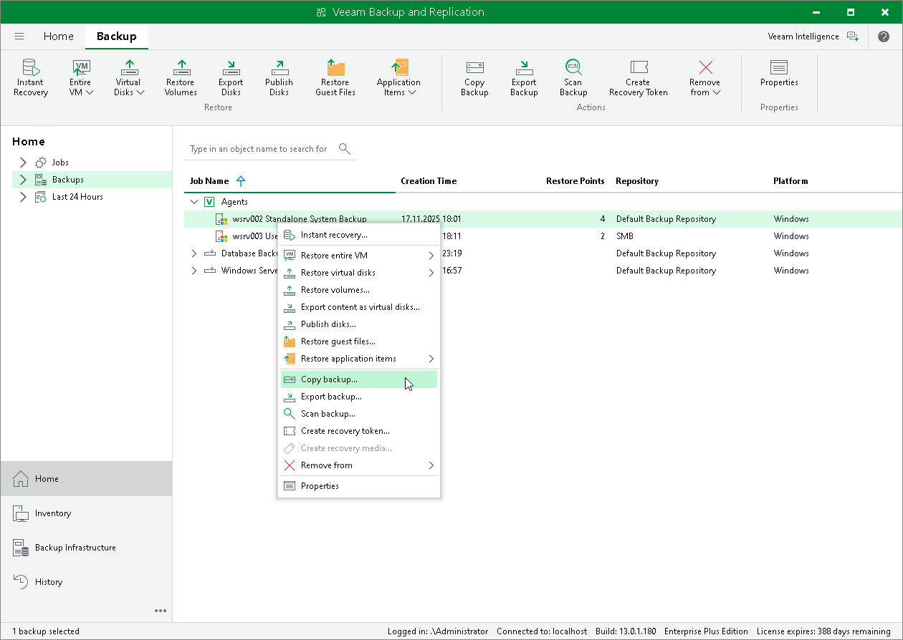

# Copying Veeam Agent Backups

Veeam Backup & Replication offers the copying backup functionality that can be helpful if you want to copy backups of a backup job to another repository, local or shared folder.

When Veeam Backup & Replication performs the copy operation, it disables the job, copies files to the target location and then enables the job. After the copy operation finishes, the copied backups are shown in a node with the (Exported) postfix in the inventory pane.

|  |
| --- |
| NOTE |
| You cannot copy backups to/from object storage repositories. |

To copy a backup, do the following:

1. Open the Home view.
2. In the inventory pane, click Backups.
3. In the working area, right-click the backup and select Copy backup.

