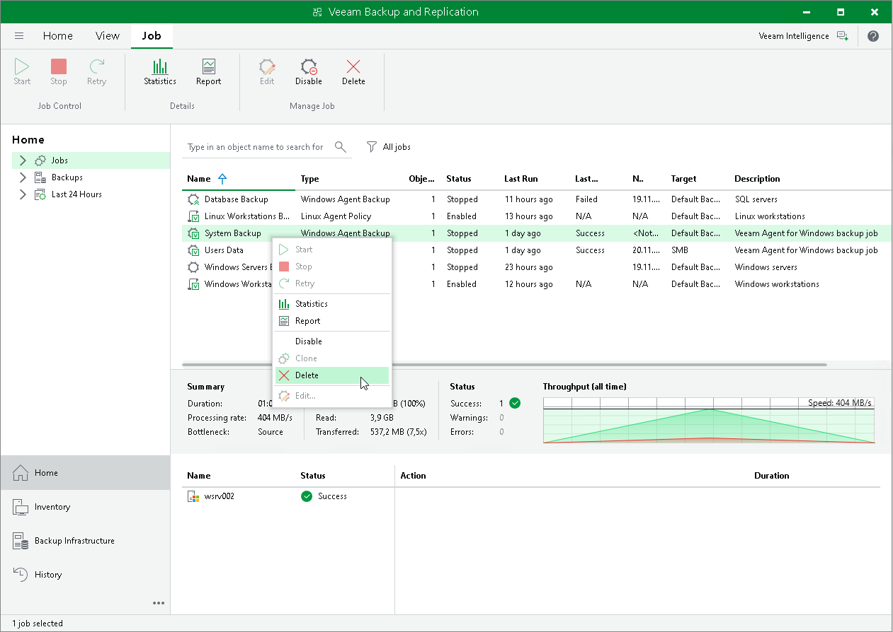

# Deleting Veeam Agent Backup Jobs

You can delete Veeam Agent backup jobs.

When you delete a Veeam Agent backup job, Veeam Backup & Replication removes all records about the job from its database and console. When the user starts a new Veeam Agent backup job session manually or the job starts automatically by schedule, the job will appear in the Veeam Backup & Replication console again, and records about a new job session will be stored in the Veeam Backup & Replication database.

|  |
| --- |
| NOTE |
| When you delete a Veeam Agent backup job, the backup files become orphaned and can be deleted by the background retention. For more information about the background retention, see the [Background Retention](https://helpcenter.veeam.com/docs/vbr/userguide/background_retention_job.html?ver=13) section in the Veeam Backup & Replication User Guide. |

To prevent the job from starting permanently, you must delete the job and unassign access rights permissions for this user from the backup repository. To completely delete the job, you must perform this operation in Veeam Agent on the Veeam Agent computer.

To remove a job:

1. In Veeam Backup & Replication, open the Home view.
2. In the inventory pane, click the Jobs node.
3. Select the necessary job in the working area and click Delete on the ribbon, or right-click the necessary job in the working area and select Delete.

