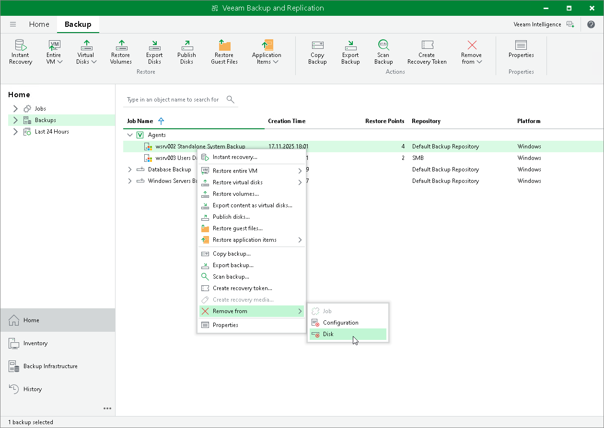

# Removing Veeam Agent Backups from Disk

If you want to delete records about backups from the Veeam Backup & Replication console and configuration database and, additionally, delete backup files from the backup repository, you can use the Remove from disk operation.

To remove a Veeam Agent backup from the backup repository:

1. Open the Home view.
2. In the inventory pane, click Backups.
3. Select the necessary computer backup and click Remove from > Disk on the ribbon or right-click the computer and select Remove from > Disk.

