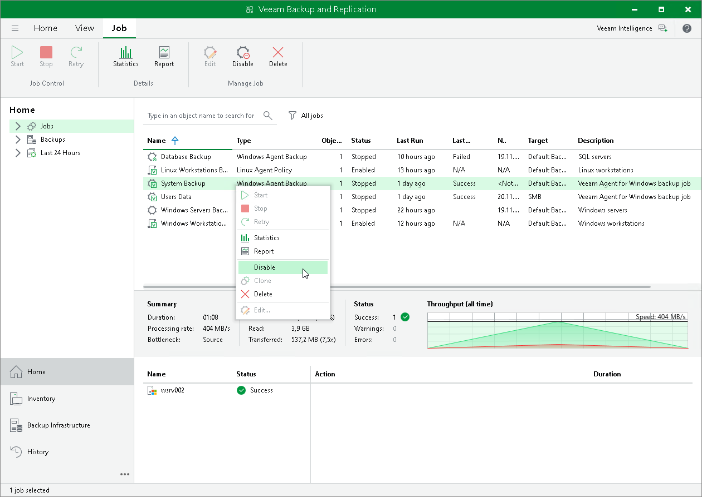

# Enabling and Disabling Veeam Agent Backup Jobs

You can disable and enable Veeam Agent jobs in Veeam Backup & Replication.

When you disable the job, you prohibit the user to store the resulting backup in the backup repository. If the user starts a disabled job manually or the job starts by schedule, the job session will fail and report the "The job has been disabled by the Veeam Backup & Replication administrator"  error. To let Veeam Agent store backups in the backup repository again, you must enable the disabled job.

To disable or enable the scheduled backup job in Veeam Backup & Replication:

1. In Veeam Backup & Replication, open the Home view.
2. In the inventory pane, click the Jobs node.
3. Select the necessary job in the working area and click Disable on the ribbon, or right-click the necessary job in the working area and select Disable. To enable the disabled job, click Disable on the toolbar, or right-click the job and select Disable once again.

