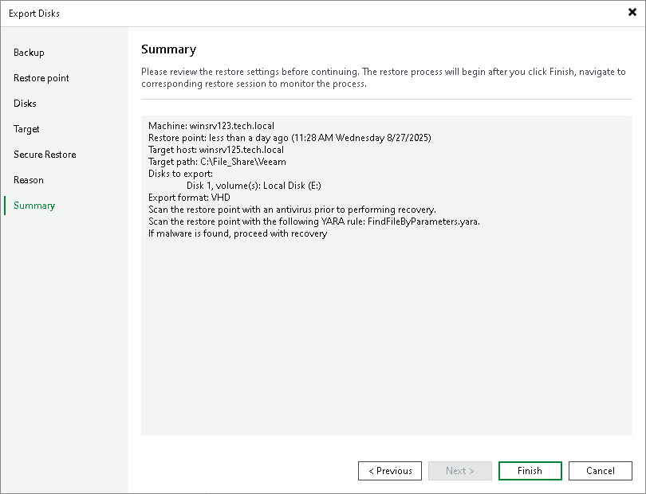

# Step 8. Complete Restore Process

At the Summary step of the wizard, complete the disk restore procedure.

1. Review details for the disk to be restored.
2. Click Finish to start the restore procedure and exit the wizard.

